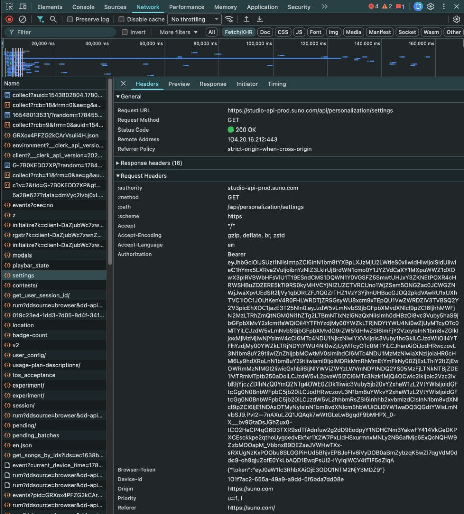

# Download Suno Audio & Lyrics

Attach a Suno track to a post under `src/content/blog/<slug>/`.

## Outputs

| Lang | Audio | Lyrics |
|------|-------|--------|
| `vn` | `audio.mp3` | `lyrics.json`, `lyrics.lrc` |
| `en` | `audio.en.mp3` | `lyrics.en.json`, `lyrics.en.lrc` |

Then set frontmatter:

```yaml
# index.md
music: "./audio.mp3"

# index.en.md
music: "./audio.en.mp3"
```

Do **not** rewrite post body when only attaching music.

---

## Auth: get a fresh access token

Aligned lyrics require a Bearer JWT. Cookies in `.env` expire often; prefer a fresh token from the browser.

### Steps

1. Open [https://suno.com](https://suno.com) while logged in
2. Open DevTools → **Network**
3. Filter **Fetch/XHR**
4. Click any authenticated API call (e.g. `settings` → `https://studio-api.prod.suno.com/api/personalization/settings`)
5. Open **Headers** → **Request Headers** → copy the value of `Authorization`
6. It looks like: `Bearer eyJhbGciOiJSUzI1NiIs...` — use the JWT part after `Bearer `



### Store the token (pick one)

**A. One-shot env (preferred for agent runs)**

```bash
export SUNO_TOKEN='eyJ...'   # JWT only, no "Bearer " prefix
```

**B. Project `.env`**

```bash
# JWT only (script also still accepts legacy SUNO_COOKIE=__session=...)
SUNO_TOKEN=eyJ...
```

Never commit `.env` or paste long-lived tokens into git-tracked files.

Token `exp` is short (~1 hour). On `401 Unauthorized`, ask the user for a fresh token.

---

## Download

Script: [`scripts/download_suno_lyrics.py`](../../scripts/download_suno_lyrics.py)

```bash
# From repo root
export SUNO_TOKEN='eyJ...'   # if not already in .env

# Vietnamese track
python3 scripts/download_suno_lyrics.py "https://suno.com/s/<shareId>" \
  src/content/blog/<slug> vn

# English track
python3 scripts/download_suno_lyrics.py "https://suno.com/s/<shareId>" \
  src/content/blog/<slug> en
```

Also accepts a song UUID: `xxxxxxxx-xxxx-xxxx-xxxx-xxxxxxxxxxxx`.

### If share-URL resolve fails (SSL / empty page)

Resolve UUID with curl, then pass UUID to the script:

```bash
curl -sL "https://suno.com/s/<shareId>" -A "Mozilla/5.0" \
  | rg -o 'suno\.com/song/[0-9a-fA-F-]{36}' | head -1
```

If `audio*.mp3` is 0 bytes, download CDN directly:

```bash
# after you know song_id
curl -sL "https://cdn1.suno.ai/<song_id>.mp3" -o src/content/blog/<slug>/audio.mp3
```

Lyrics API:

`GET https://studio-api.prod.suno.com/api/gen/<song_id>/aligned_lyrics/v2/`  
Header: `Authorization: Bearer <SUNO_TOKEN>`

---

## Agent checklist

1. Confirm slug / output dir
2. Ask for `SUNO_TOKEN` if lyrics return 401 (point user to screenshot above)
3. Run script for `vn` and/or `en`
4. Verify file sizes (`audio*.mp3` > 0, `.lrc` has timed lines)
5. Set `music:` in the matching frontmatter only
6. Do not rewrite post prose unless the user asks

## Example (hat-giong-moi)

```bash
export SUNO_TOKEN='eyJ...'
python3 scripts/download_suno_lyrics.py "https://suno.com/s/wiJgC3Dv2gZUjXZP" \
  src/content/blog/hat-giong-moi vn
python3 scripts/download_suno_lyrics.py "https://suno.com/s/Dwg7Ll2NJwD8CgXb" \
  src/content/blog/hat-giong-moi en
```
