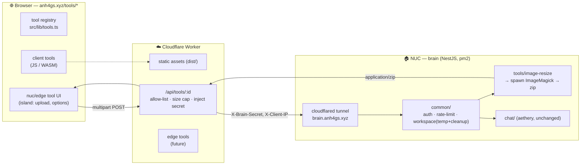
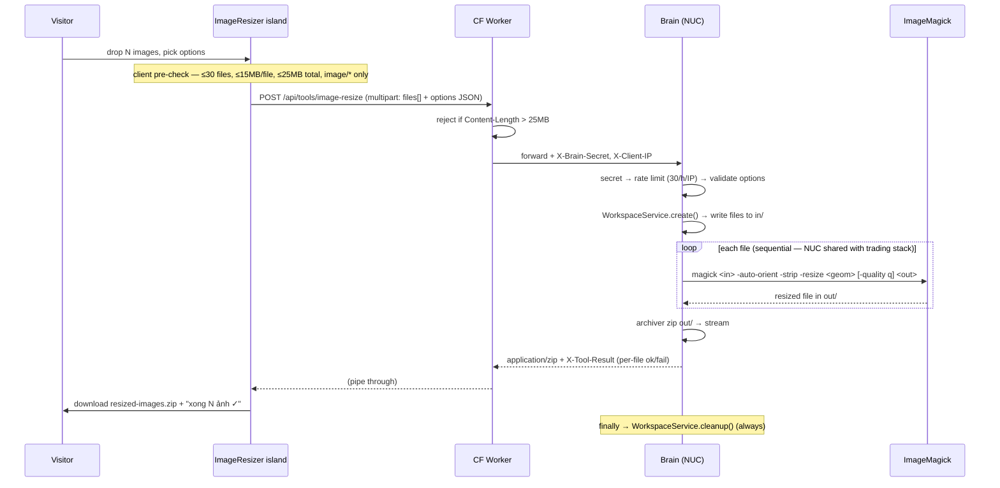

# Tools Platform — Architecture North-Star

> **Status: foundation implemented 26-07-19.** First tool (batch image-resizer) built + verified end-to-end locally. This is the **evergreen direction doc** (`00-00-00` = not a dated log) for turning anh4gs.xyz into a host for many small utility tools. New tool plans should reference this and respect the tier boundaries below.
>
> Code landed: `brain/src/common/`, `brain/src/tools/image-resize/`, `worker/index.ts` (`/api/tools/:id`), `src/lib/tools.ts`, `src/pages/tools/`, `src/components/tools/ImageResizer.astro`.

## Goal

One site, many tiny tools — each solving a small daily annoyance fast, no login, no friction. Some are viral/free (QR, palette), some are the moat (image/PDF, AI wrappers, dev-infra tools that lean on the author's trading/low-latency background). The architecture must make **adding a tool cheap** while keeping heavy/native work isolated on the NUC.

## Core principle — 3-tier runtime model

The one decision that keeps dozens of tools from turning into chaos: **every tool declares where it runs** (`runtime` field in `src/lib/tools.ts`). That field alone decides the wiring.

| Tier | Runs on | Good for | Cost / limits |
|------|---------|----------|---------------|
| **`client`** | Browser (JS/WASM) | data never leaves the machine; infinite CDN scale | free, but no native binaries / big compute |
| **`edge`** | Cloudflare Worker | light network + logic, LLM API proxy | ~10ms CPU, no filesystem, no binaries |
| **`nuc`** | NestJS brain on the NUC | native binaries, filesystem, CLI, `claude` CLI | full power, single node → needs abuse gates |

### Roadmap mapped to tiers

- **`client`** — QR, Color Picker, Palette, Lorem, Markdown cleaner, Reading-time, JSON diff, Regex tester, Cron builder, SQL formatter, JWT debugger, Env comparer, Token calc, Timezone planner, SIP/FIRE/DCA/Currency/Portfolio calculators, Bill splitter, all checklists/trackers (localStorage), small Image compressor
- **`edge`** — Currency (live rates), Webhook replay, API history (+KV), SEO checker, thin LLM wrappers (call Anthropic API from the Worker)
- **`nuc`** — 🎯 **Batch Image Resizer**, PDF Merge/Compress, Background Remover, SVG Optimizer, and the "paste X → improve" family (Slack improver, PR explainer, meeting→action items, TL;DR, ATS score, flashcards…), plus the signature set: Architecture / Sequence / DAG visualizers, Market-Data Debugger

Strategy: ship `client` tools first for reach (zero cost, viral), invest `nuc` for the hard-to-copy moat.

## Architecture



Key properties:

- **Same edge pattern as aethery chat** — the Worker is the gate (secret injection, IP forwarding, oversize rejection); the brain does the heavy work. Tools reuse the tunnel + secret that already exist.
- **Brain is now modular** — `common/` holds shared plumbing; each tool is a self-contained folder. Chat became "just another consumer" of `common/` without being touched.
- **Stateless per request** — a tool request creates a temp workspace, processes, streams the result, and cleans up in `finally`. No job store needed for fast tools (async job model is reserved for future heavy tools like video/bg-remove).

## Repo structure

```text
src/
  lib/tools.ts                      # registry: Tool[] { slug, runtime, category, status, ... }
  pages/tools/
    index.astro                     # gallery — renders from registry, grouped by category
    image-resizer.astro             # one page per tool
  components/tools/
    ImageResizer.astro              # interactive island (dropzone, options, download zip)

worker/index.ts                     # TOOL_ROUTES allow-list → proxy /api/tools/:id → brain

brain/src/
  common/
    brain-auth.ts                   # X-Brain-Secret check (shared)
    rate-limit.service.ts           # generic keyed sliding-window limiter
    workspace.service.ts            # per-job temp dir (in/ out/) + best-effort cleanup
  tools/
    tools.module.ts
    image-resize/
      types.ts                      # ResizeOptions + limits (mirrored on the Worker)
      image-resize.service.ts       # validate + spawn ImageMagick + geometry
      image-resize.controller.ts    # multipart in → zip out (+ X-Tool-Result summary)
  chat/                             # aethery — unchanged
```

## Adding a new tool

1. **Add a registry entry** in `src/lib/tools.ts` (`slug`, `runtime`, `category`, `status`). The gallery picks it up automatically.
2. **Add the page** `src/pages/tools/<slug>.astro` (+ an island component if interactive).
3. If `runtime: 'nuc'`:
   - add a controller/service under `brain/src/tools/<slug>/`, register in `tools.module.ts`;
   - allow-list the route in `worker/index.ts` `TOOL_ROUTES` (with its own `maxBytes`).
   - reuse `WorkspaceService` + `RateLimitService` from `common/`.
4. If `runtime: 'edge'`: handle it inside the Worker (no brain hop).
5. If `runtime: 'client'`: everything lives in the page/island — no backend.

## First vertical slice — batch image-resizer (`runtime: nuc`)



**Options:** mode `percent | width | height | fit`, format `keep | jpeg | png | webp`, quality (jpeg/webp), `noUpscale` (default on, appends `>` to geometry). JPEG target flattens alpha onto white.

**Abuse gates:** Turnstile-free for now; protected by edge size cap + per-IP rate limit + per-file ImageMagick resource limits (`-limit memory/map/disk/time`) against decompression bombs. Filenames sanitized; spawn uses an args array (no shell) → no injection.

**Verified locally (26-07-19)** against real ImageMagick 7.1.2:

- percent 50%: 400×300→200×150, 640×480→320×240; zip names correct
- fit 300×300 + →JPG: 640×480→300×225, alpha flattened
- width 800 + noUpscale on 400px image: stays 400×300
- error paths: percent 0 → 400, `.txt` → 400 "No supported image files", missing binary → clean 500 (no crash)
- workspace cleanup leaves no temp dirs

Brain typecheck + astro check/build + worker typecheck all pass.

## Cross-cutting concerns

- **Auth** — shared `X-Brain-Secret` injected by the Worker (dev bypasses when no secret set). Same model as chat.
- **Rate limit** — generic keyed limiter in `common/`; each tool namespaces its bucket (`"<tool>:<ip>"`) with its own hourly budget. Chat keeps its own copy (untouched).
- **Size caps** — declared once per tool: at the edge (`TOOL_ROUTES[id].maxBytes`, hard-enforced pre-brain) and in the brain (`MAX_FILE_BYTES`, `MAX_FILES`). Client mirrors them for instant UX feedback.
- **Cleanup** — every `nuc` tool wraps work in `try/finally` around `WorkspaceService.cleanup()`.
- **Monetization hook (future)** — the registry + per-IP metering already give the seams to gate free vs. paid later; not built yet.

## Deploy

Reuses the aethery pipeline (see `brain/README.md`), no new secrets:

- **Brain (NUC)** — `cd ~/prod/xaolonist.eth && git pull && yarn install && yarn workspace @xaolonist/brain build && pm2 restart aethery-brain`. **Plus one-time: install ImageMagick** (`sudo apt-get install -y imagemagick` → provides `convert`; the service auto-detects `magick`→`convert`, or set `MAGICK_BIN`). Not preinstalled on the NUC as of 26-07-19.
- **Worker + site** — `yarn deploy` (repo root) = `astro build && wrangler deploy`. Publishes `/tools/*` pages + `/api/tools/*` route.
- Order: brain first, then worker/site.

## Trade-offs accepted

- **Single node** — all `nuc` tools share one NUC (also running the trading stack + aethery). Sequential processing + rate limits + resource caps keep it polite. Scale-out is a later problem.
- **No async jobs yet** — fast tools answer in one request→response. Heavy tools (video, bg-remove) will need a job + progress-SSE abstraction; `common/` is where that lands.
- **Availability** — `nuc`/`edge` tools are down when the NUC/tunnel is down; `client` tools keep working (served from the edge). Discoverability: a `/tools` link should be added to the nav (Forge realm is the natural home) — not done yet.

## Open decisions / next

- [ ] Add `/tools` to `NavBar` (or surface under Forge)
- [x] EN mirrors for tool pages — `/en/tools`, `/en/tools/image-resizer` (component is bilingual via a `lang` prop; done 26-07-19)
- [ ] Turnstile on `nuc` tools if abuse shows up
- [ ] Job/progress abstraction before the first long-running tool
- [ ] Second tool to validate the "add a tool" flow (candidate: a `client` tool for reach, e.g. QR or palette)
