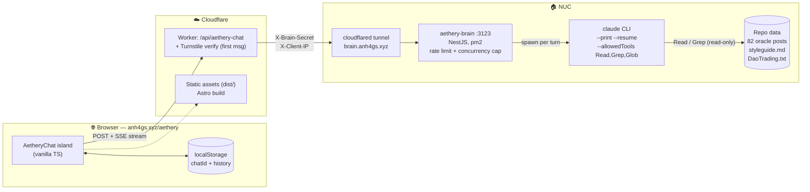
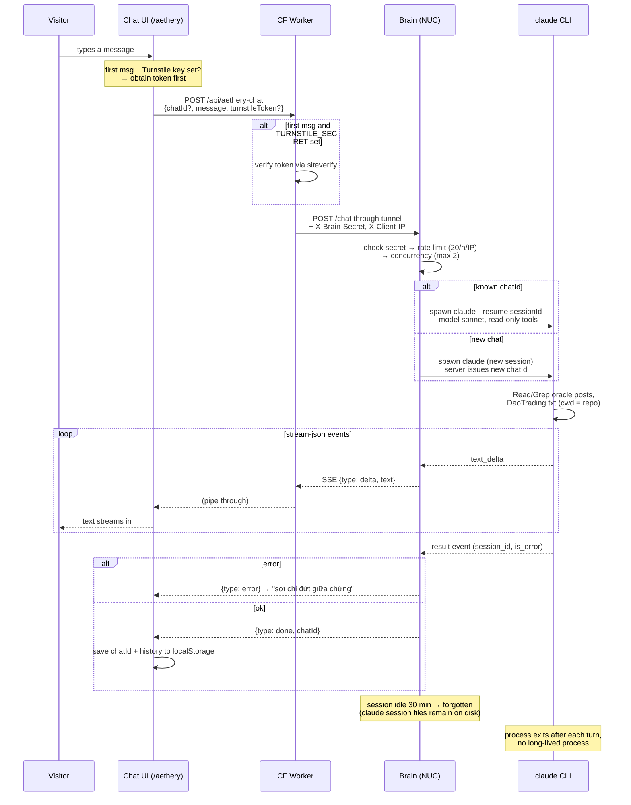

# Aethery Chat Page — Proposal v2 (26-07-17)

> **Status: implemented 26-07-17** (monorepo Option A). Code: `brain/`, `worker/index.ts`, `src/components/AetheryChat.astro`, `pm2/ecosystem.brain.config.js`. Verified locally end-to-end against the real claude CLI (streaming, `--resume` continuity, error paths). Remaining: NUC setup + Worker secrets — see `brain/README.md`. Note: brain defaults to `--model sonnet` because the CLI's default alias resolves to a 1M-context model that 429s without usage credits.

## Goal

Chat box on `/aethery`: conversation with a Claude-powered brain speaking in the oracle voice ("hắn"/"@aethery", "Thị", "tánh biết"), drawing on the oracle blog corpus. Brain runs on the **NUC via the locally installed `claude` CLI** (subscription — no per-token API cost), modeled on `djao-trading/agent-bot`.

## Decisions (from user, 26-07-17)

1. Route: **`/aethery`** — chat section added below the existing aethery profile page (VN + EN)
2. Backend: **route requests to the NUC**, agent-bot style, using the pre-installed `claude` CLI (no Anthropic API key / no token billing)
3. Monorepo: **Option A** — root stays the Astro site, `brain/` added as a yarn workspace (`worker/` is a plain dir bundled by wrangler, not a workspace)

## Verified facts

- Site: Astro 5 static, deployed as CF Worker + `assets` binding (`wrangler.jsonc`), `yarn deploy` = `astro build && wrangler deploy`
- NUC already has a checkout of this repo running `claude remote-control` under pm2 (`pm2/ecosystem.claude-rc.config.js`) → claude CLI installed, repo present, pm2 pattern established
- `claude` CLI supports `--print`, `--resume <sessionId>`, `--output-format stream-json`, `--append-system-prompt`, `--allowedTools` — same primitives agent-bot uses (`AiExecutorService`: spawn per turn + `--resume`, no long-lived process)
- Repo CLAUDE.md + `content/styleguide/styleguide.md` + `DaoTrading.txt` already encode the voice — claude CLI running with cwd = repo picks up CLAUDE.md automatically

## Architecture

### Component overview

### Turn lifecycle

Key properties the diagrams encode:

- **No long-lived process**: each turn is a fresh claude spawn; continuity comes from `claude --resume <sessionId>` (agent-bot pattern)
- **Three abuse gates** before anything touches claude: Turnstile at the edge, then shared secret + per-IP rate limit + concurrency cap in the brain
- **Content-stateless server**: visible history lives in the visitor's localStorage; the brain only keeps an in-RAM `chatId → claudeSessionId` map, losing it just means the visitor starts a fresh conversation

### Components

#### 1. `brain/` workspace (runs on NUC)

- NestJS (mirrors agent-bot structure) with: `ChatController` (POST /chat, SSE + GET /health), `ClaudeExecutorService` (spawn + `--resume` session map + 30-min idle timeout — port of agent-bot's `AiExecutorService`, minus Redis RPC since we go HTTP), `RateLimitService` (in-memory sliding window, 20 msgs/h/IP), concurrency cap (2 parallel claude processes)
- Claude invocation: cwd = repo root so CLAUDE.md/styleguide load naturally; `--append-system-prompt` with the aethery persona (`brain/src/chat/aethery-prompt.ts`); **read-only tools only**: `--allowedTools "Read,Grep,Glob"` — no Bash/Write/Edit (public traffic → prompt-injection surface must be read-only); `--max-turns 8`; `--model sonnet` (standard context)
- Data access = Claude reads `src/content/blog/*` (oracle posts) and greps `DaoTrading.txt` itself — genuinely "data + hành văn giống /oracle" without a corpus build step
- Auth: shared secret header (`X-Brain-Secret`) from the CF Worker; unauthenticated requests rejected when `BRAIN_SECRET` is set

#### 2. CF Worker proxy (`worker/index.ts`)

- `main` entry in `wrangler.jsonc` + `run_worker_first: ["/api/*"]`; `/api/aethery-chat` → proxy to tunnel hostname (`BRAIN_URL` var) with secret header; everything else falls through to static assets via the `ASSETS` binding
- Turnstile verification on the **first message of a conversation only** (when `TURNSTILE_SECRET` is set); errors returned in the same SSE shape the brain uses so the UI has one parser

#### 3. Frontend — `src/components/AetheryChat.astro`

- Chat section below the existing profile/music player on `/aethery` and `/en/aethery`; vanilla TS island; streaming render; history client-side (localStorage, capped 40 items) with a server-issued `chatId`
- In `yarn dev` the island calls a locally running brain (`localhost:3123`) directly, bypassing the Worker
- Optional Turnstile widget rendered lazily when `PUBLIC_TURNSTILE_SITE_KEY` is set at build time

#### 4. NUC deploy

- `git pull` + `yarn install` + `yarn workspace @xaolonist/brain build` + `pm2 start pm2/ecosystem.brain.config.js` (same pattern as `claude-rc-xaolonist`); env via `brain/.env` (see `brain/.env.example`)
- `cloudflared` tunnel config (new, one-time setup) — full steps in `brain/README.md`

## Monorepo shape

**Option A — minimal churn (chosen):** root package stays the Astro site; `"workspaces": ["brain"]` in root package.json. `yarn deploy`, wrangler paths, CF setup all unchanged. Yarn Berry handles root-as-package + child workspaces fine (djao-trading precedent).

**Option B — full split (rejected):** `site/` + `brain/` + `worker/` with a shell root. Cleaner but touches every path, CF deploy config, and the NUC checkout. Not worth it unless more apps are coming.

## Trade-offs accepted (vs API version)

- **Latency**: claude CLI turn = ~4–20s (process spawn + optional file reads; measured ~4–8s locally for light turns). Mitigated by streaming + a "nàng đang lắng nghe…" typing state. This is a contemplative oracle, slow is on-brand
- **No token cost, but**: burns Claude subscription usage quota + NUC CPU → Turnstile + rate limit + concurrency cap remain **mandatory**, not optional
- **Availability**: chat is down when the NUC is down — acceptable for a personal site; the UI shows "nàng đang thiền, lát nữa quay lại nhé" on tunnel failure

## Production rollout — DONE 26-07-17

- [x] Commit + push `5d51ab9` — Worker + assets auto-deployed via git push (Workers Builds); no manual `yarn deploy` needed
- [x] NUC: corepack/yarn 4 enabled, brain built, `brain/.env` with `BRAIN_SECRET`, pm2 app `aethery-brain` (saved)
- [x] cloudflared 2026.7.2 (no sudo, `~/.local/bin`), tunnel `aethery-brain` (8731e5e1) → `brain.anh4gs.xyz`, pm2 app `aethery-tunnel`
- [x] `wrangler secret put BRAIN_SECRET` (piped from NUC `.env`, OAuth login on dev Mac; wrangler needs node ≥22 → brew `node@22` keg-only)
- [x] E2E verified on anh4gs.xyz: streaming reply in oracle voice citing real slugs (~10–13s/turn), `--resume` continuity, unauthorized/404 paths
- [ ] Optional later: Turnstile (`TURNSTILE_SECRET` + `PUBLIC_TURNSTILE_SITE_KEY`)

## Effort (actual)

- Monorepo restructure (Option A): ~15 min
- Brain service (port agent-bot executor + HTTP/SSE): ~2h including debugging the 1M-context 429
- Worker proxy + Turnstile: ~30 min
- Chat UI on /aethery (VN + EN): ~1h
- NUC: pm2 + cloudflared setup: pending, est. ~1–2h
