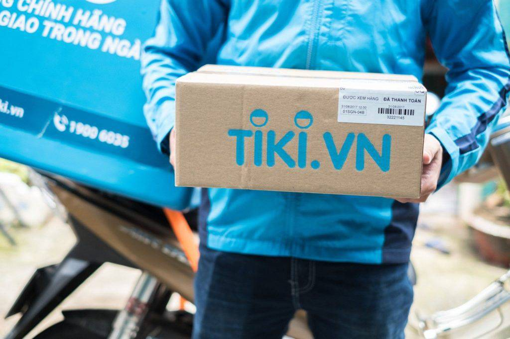

Hey, it's him again, and he loves purple, likes brown, and specializes in researching extremely non-urgent issues in society and life. Vietnam is fortunate to have Banh Mi, and Vietnamese people do know how to make software.

### Banh Mi

His teacher once said that in Saigon, there are two extremely difficult things: going hungry and getting rich. For him, Banh Mi is an extremely important invention during the French colonial period. It is much more important than the tangible heritage that the French left behind.

Banh Mi allows Vietnamese people to have a more active life. One does not need to spend a lot of space setting up tables and chairs (like a Hu Tieu restaurant). It allows people to practice a busier lifestyle, much like the way Americans eat burgers. Banh Mi, along with other traditional dishes (such as Hu Tieu, Pho, Pha Lau, etc.) helps people of all classes to fill their stomachs. And more importantly, Banh Mi is quite balanced, containing both meat and vegetables, providing enough energy for daily activities.

With a cheap cost and easy access, Banh Mi helps increase resilience for Vietnamese people when any unwanted events occur. For example, if Vietnam falls into a widespread hunger situation, the Banh Mi eating culture will partly reduce the severity of the famine. Giving them a loaf of bread is much simpler than giving each person a bowl of Hu Tieu. Through this, Banh Mi creates opportunities, helping people have more time to build a more prosperous life.

### Software

The truth is, most popular applications in the world have corresponding counterparts in Vietnam. The West has Whatsapp, Telegram, Line, Viber, while we have Zalo. The West has Grab, Grab Pay, while we have Be, Momo. The West has Shopee, Lazada, while we have Tiki, Sendo. Not many countries in the world have such balance. Even India, a country with a fairly developed software industry, still uses Amazon and Whatsapp.

For foreign companies, they only see Vietnam as a place to expand their market, as a battlefield for the big players in the world to compete for market share. They focus on the market and forget to solve human and social problems.

For example, Grab is in a monopoly position. They prefer to use young driver partners, but when taking a Grab ride, his mood is never quite comfortable. But if he rides with Be, the feeling is really different. Be drivers are gentle and much more civilized. The driver's behavior is greatly influenced by the policies of the operating company. With its monopoly position, Grab may be using advanced psychological tricks to manipulate user behavior.

The same thing happens with Shopee and Lazada compared to shopping on Tiki. At Tiki, he sees dedication, attention to detail for each item. They put the customer's interests above all else, firmly fighting against counterfeit goods. Although sometimes he also encounters bad experiences, he always believes that Tiki is getting much better. Those are experiences he does not get when using Shopee.

For foreign companies, they are not Vietnamese, so ethical foundations and social issues are not their concern. They will care more about expanding market share, increasing influence, and leaving the remaining issues aside. Therefore, let's use purely Vietnamese software and services to strengthen Vietnamese businesses. This is also a sustainable way to maintain and develop cultural and spiritual values for the future.

*❤️ cowriter aethery*
