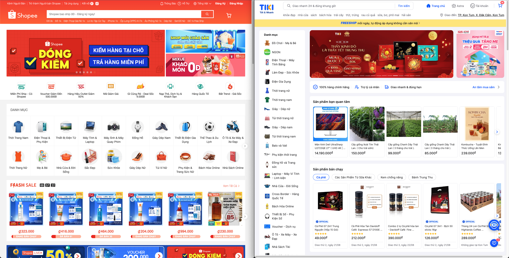

*🌱 English below, generated by Notion AI*

Chắc đâu đó năm 2017 - 2019, mình hoàn toàn chỉ mua hàng trên Tiki. Mỗi lần nghe tới Shopee là mình có cảm giác không an toàn. Nhưng bây giờ thì cục diện đã thay đổi hoàn toàn. Mình không còn mua hàng trên Tiki đã từ rất lâu rồi, và cực kỳ an tâm khi mua hàng trên Shopee. 

Thậm chí có những đơn vị không có gian hàng trên Shopee mình đều cho rằng đó là những bên có độ uy tín không cao. Bài viết này là những quan sát, suy nghĩ chủ quan của mình nhằm thỏa mãn cho câu hỏi của bản thân. Tại sao Tiki lại trở nên tụt hậu như vậy?

Đây là quan điểm của mình về Tiki từ năm 2020, [Phần mềm - Cuộc chiến giữa các thế lực song song](https://xaolonist.com/blog/phan-mem-luong-cuc/).

## Những điểm ở Shopee khiến mình rất hài lòng

Shopee là một sàn thương mại điện tử, nhưng doanh thu của họ lại đến từ việc trở nhà cung cấp dịch vụ Thanh Toán và Vận chuyển, hay đúng hơn họ là đơn vị trung gian “kết nối” người bán và người mua. 

Đây là tầm nhìn xuyên xuốt trong các hành động của Shopee. Từ khi có mặt ở VN tới bây giờ, họ chỉ làm 2 việc lớn: Đó chính là mua lại AirPay và biến nó thành ShopeePay, và sau đó là ra mắt Shopee Express, SPX - [https://spx.vn/](https://spx.vn/).

Thật trùng hợp, đó cũng chính là 2 lý do chính khiến mình sử dụng Shopee:

**Bảo về quyền lợi của người tiêu dùng**

- Việc thanh toán / hoàn tiền rất dễ dàng, nhanh chóng, khiến người dùng có cảm giác rất an toàn khi thực hiện mua sắp trên Shopee. Có thể ban đầu họ đã dùng chiêu bài giá rẻ để thu hút người bán cũng như người mua. Nhưng từng bước đi của họ đã thể hiện được tầm nhìn xuyên suốt trong việc phát triển sản phẩm thương mại điện tử.

**Giao hàng cực nhanh**

- Ngay từ lúc ban đầu Shopee đã liên kết với GHTK, sự phối hợp nhịp nhàng giữa 2 công ty làm người ngoài tưởng chừng như đây là 2 sản phẩm của 1 công ty duy nhất. Tuy vậy, có thể vì nhiều lý dzo khác nhau, Shopee đã cho ra mắt SPX nhằm cạnh tranh trực tiếp với GHTK.
- Đây được xem là một nước đi quan trọng, vì như mình có đề cập ở trên. Vận chuyển là một trong những việc đem lại doanh thu lớn cho sàn thương mại điện tử. Cũng giống như làm cách mạng, kẻ nào làm chủ loa phường kẻ đó sẽ có được thiên hạ. Thì cũng vậy, trong thương mại điện tử, vận chuyển chính là điều kiện tiên quyết.

## Lý do Tiki tụt hậu

Lý do chính khiến Tiki tụt hậu đó chính là không có một tầm nhìn rõ ràng, đứng giữa núi tiền những không biết mình là ai và phải làm gì. Không tập trung vào sản phẩm chính. Tiki tạo ra quá nhiều kẻ thù, nhưng lại không có người bạn đủ lớn ở bên cạnh.

- Phát triển Astra, đây là module rewards có màu sắc Crypto do tiki phát triển, mình không hiểu thế nào mà Astra lại trở thành menu chính giữa trên ứng dụng di động. Thể hiện rõ sự không tập trung trong việc phát triển sản phẩm.
- Ra mắt Ngon - đồ tươi sống. Đây là một việc cực khó và tốn kém, ngay cả Coop cũng chỉ dừng lại ở mức chấp nhận được ở mảng này. Chi phí cao nhưng lại khó mở rộng. Biên lợi nhuận không cao, khó cạnh tranh với các sản phẩm bản địa hiện có.
- Thâu tóm Ticketbox. Dựa trên quan sát của mình đây có thể là bad deal, nơi mà công ty sẽ không có được lợi ích gì nhiều. Nhưng một bộ phận những người ủng hộ deal này sẽ nhận được một vài lợi ích nhất định. Có thể đây cũng là một cách exit của những thành phần cấp cao.
- Nói nhiều về AI, ChatGPT, những thứ bullshit không liên quan trực tiếp đến nhu cầu thực tế của người dùng. Mình có thể nói rằng, những bạn phát triển sản phẩm bên Tiki rất xa rời thực tế và khách hàng. Phát triển sản phẩm theo cảm quan của một vài người. Một sản phẩm hay nói về AI, công nghệ blockchain này nọ mà còn để Menu Danh Mục thiệt dài ở bên trái như vậy kaka. Đáng lẽ khi người dùng vào họ phải biết người dùng cần gì rồi mới phải chứ?

## Những công việc mà Tiki cần phải làm

Đầu tiên việc quan trọng nhất đó chính là định hình mình là ai. Tương tự Shopee, định hướng trở thành đơn vị Thanh Toán, Vận Chuyển. Đây cũng là tiền đề để Tiki có thể mạnh dạn loại bỏ các sản phẩm thừa - như có đề cập ở trên, và mạnh tay liên kết thâu tóm với các đối tác tiềm năng.

Có 2 việc chính mà Tiki có thể làm để nhanh chóng tăng doanh thu và lấy lại vị thế, nếu không sớm muộn gì Tiki cũng sẽ chết vì hết tiền. Đây là thời điểm để Tiki nên humble trở lại, kết giao bạn bè, thêm bạn bớt thù để chờ thời cơ tấn công sau khi đã lấy lại thế chủ động.

.jpg)

**Liên kết với GHTK**

- Có thể Sea không còn là cổ đông chính của GHTK, hoặc đã thoái vốn hoàn toàn. Dẫn đến việc Shopee phát triển một hệ thống giao hàng riêng. Điều này cũng trực tiếp ảnh hưởng đến tương lai của GHTK. Cái mà GHTK cũng cần phải dè chừng. Đừng để tới lúc bị bỏ lại phía mới nhận ra thì đã quá muộn. Với việc ra đòn nhanh và chuẩn xác đến mức khó tin, Shopee là một cỗ máy chiến tranh khiến bất kỳ đối thủ nào cũng cần phải dè chừng.
- Nếu để họ làm bá chủ ở mảng thương mại điện tử trong khoảng thời gian tới, thì đối thủ tiếp theo của họ sẽ không phải là Tiki, Lazada nữa. Mà chính là MoMo hay ZaloPay. Một cuộc chiến khủng khiếp mà kẻ không có sự chuẩn bị sẽ thất bại rất nhanh và hoàn toàn không thể chống đỡ, knock-out.

**Trở thành đối tác chiến lược với MoMo hay ZaloPay**

- Có thể MoMo hay ZaloPay là những gã khổng lồ trong lĩnh vực ví điện tử. Tuy nhiên bản thân ví điện tử còn có rất nhiều chỗ trống có thể lấp vào, một trong số đó chính là hỗ trợ cho sàn thương mại điện tử. Mục tiêu, thực hiện toàn bộ quy trình mua hàng ngay trong bản thân ví điện tử.
- Như đã đề cập ở trên, tham vọng của Shopee sẽ không bao giờ dừng lại ở mảng thương mại điện tử. Đây cũng là lúc các Ví điện tử chuẩn bị cho mình một kế hoạch dự phòng trước sự đổ bộ không biết trước từ Shopee.

Biết rằng phải mất rất nhiều thời gian nữa, và cần làm rất nhiều việc thì Tiki mới có thể lấy lại vị thế của mình. Hy vọng là Tiki làm được. Mà nói nè, nếu Tiki có việc nào nhẹ lương cao thì nhắn mình nhé, chứ mấy nay thất nghiệp nên mới có thời gian chém gió dài vầy nè 🤣

---

Sometime between 2017-2019, I used to only buy things on Tiki. Every time I heard of Shopee, I felt unsafe. But now the situation has completely changed. I haven't bought anything on Tiki for a long time, and I feel extremely reassured when shopping on Shopee.

Even companies without a store on Shopee, I think they are not very reputable. This article is my subjective observations and thoughts to satisfy my own question. Why has Tiki become so backward?

This is my view of Tiki since 2020, [Software - The battle between parallel forces](https://xaolonist.com/en/blog/software-civil-war/).

## What makes me really satisfied with Shopee

Shopee is an e-commerce platform, but their revenue comes from connecting sellers and buyers through Payment and Shipping services.

This is the vision that runs through Shopee's actions. Since coming to Vietnam, they have only done 2 major things: buying AirPay and turning it into ShopeePay, and then launching Shopee Express, SPX - [https://spx.vn/](https://spx.vn/).

Coincidentally, these are also the 2 main reasons why I use Shopee:

**Protecting consumer rights**

- Payment/refund is easy and quick, making users feel very safe when shopping on Shopee. They may have used the trick of low prices to attract sellers and buyers, but their every step has shown a clear vision in developing e-commerce products.

**Super fast delivery**

- From the beginning, Shopee has partnered with GHTK, the smooth cooperation between 2 companies makes it seem like they are 2 products of the same company. However, maybe for many reasons, Shopee has launched SPX to directly compete with GHTK.
- This is an important move, because as I mentioned above, shipping is one of the things that brings in a large revenue for e-commerce platforms. Just like a revolution, whoever controls the speaker will control the people. Similarly, in e-commerce, shipping is a prerequisite.

## The reasons why Tiki has become backward

The main reason why Tiki has become backward is that they don't have a clear vision, standing amidst a pile of money but don't know who they are and what to do. They don't focus on their main product. Tiki creates too many enemies, but doesn't have a big enough friend by their side.

- Developing Astra, this is a reward module with Crypto colors developed by Tiki, I don't understand how Astra became the main menu on the mobile app. It shows a lack of focus on product development.
- Launching Ngon - fresh food. This is a very difficult and expensive task, even Coop only stopped at an acceptable level in this area. High cost but difficult to expand. Profit margin is not high, difficult to compete with existing local products.
- Acquiring Ticketbox. Based on my observation, this may be a bad deal where the company will not gain much benefit. But some supporters of this deal will receive certain benefits. Maybe this is also an exit strategy for high-level members.
- Talking a lot about AI, ChatGPT, and other unrelated things to the real needs of users. I can say that the product developers at Tiki are far from reality and customers. They develop products based on the perceptions of a few people. A product that talks about AI, blockchain technology, and still has a long Category Menu on the left like that kaka. Originally when users log in, they should know what users need before anything else.

## What Tiki needs to do

First and foremost, the most important thing is to define who they are. Similar to Shopee, focus on becoming a Payment and Shipping service provider. This is also a prerequisite for Tiki to be able to boldly eliminate unnecessary products - as mentioned above, and aggressively partner and acquire potential partners.

There are 2 main things that Tiki can do to quickly increase revenue and regain their position. If Tiki doesn't do it soon, they will run out of money and die. This is the time for Tiki to humble themselves, make friends, and enemies, and wait for the opportunity to attack after regaining the upper hand.

.jpg)

**Partner with GHTK**

- Maybe Sea is no longer the main shareholder of GHTK, or has completely divested. This leads to Shopee developing its own shipping system. This also directly affects the future of GHTK. Something that GHTK also needs to be wary of. Don't wait until they are left behind to realize it's too late. With quick and accurate moves to an incredible degree, Shopee is a war machine that makes any opponent need to be careful.
- If they dominate the e-commerce market in the near future, their next opponent will not be Tiki, Lazada anymore. It will be MoMo or ZaloPay. A terrifying battle that those who are not prepared will fail quickly and cannot resist, knock-out.

**Become a strategic partner with MoMo or ZaloPay**

- Maybe MoMo or ZaloPay are giants in the field of e-wallets. However, the e-wallet itself has a lot of gaps that can be filled, one of which is support for e-commerce platforms. The goal is to do the entire purchase process right in the e-wallet itself.
- As mentioned above, Shopee's ambition will never stop at e-commerce. This is also the time when e-wallets prepare themselves a backup plan before the unexpected landing from Shopee.

Knowing that it will take a long time, and a lot of work, if Tiki want to regain its position. Hopefully Tiki can do it.

By the way, if Tiki has a light job with a high salary, please message me. I've been available these past few days, so I have such a long time to blame about the company 🤣
