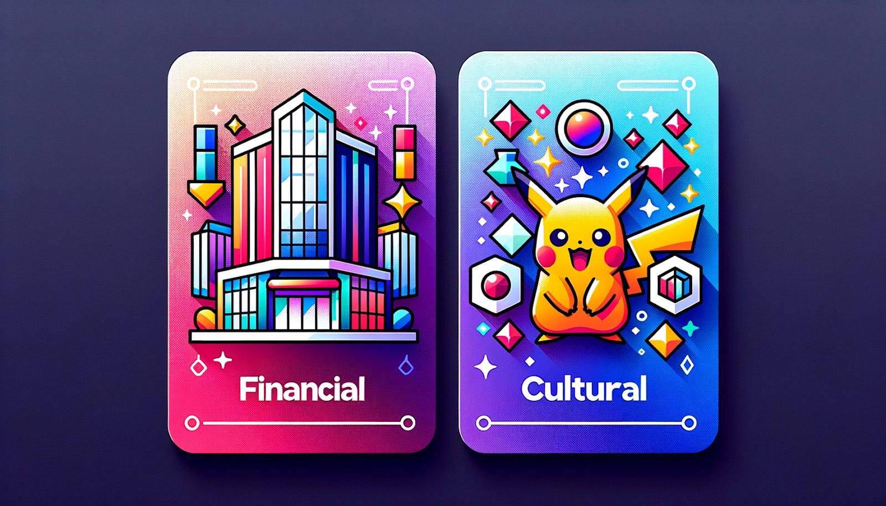
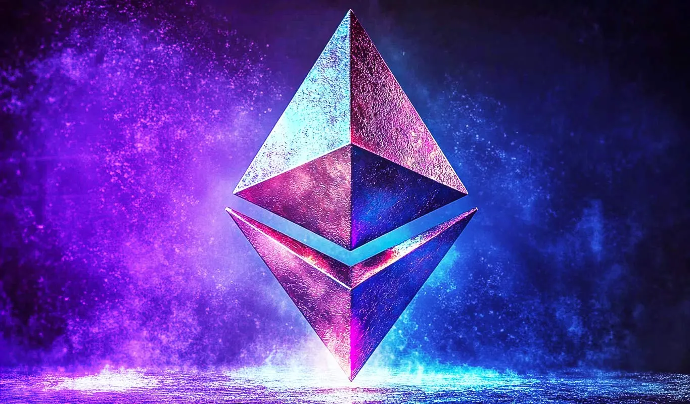
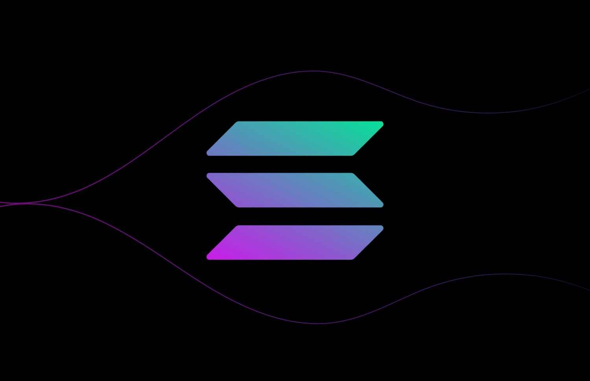
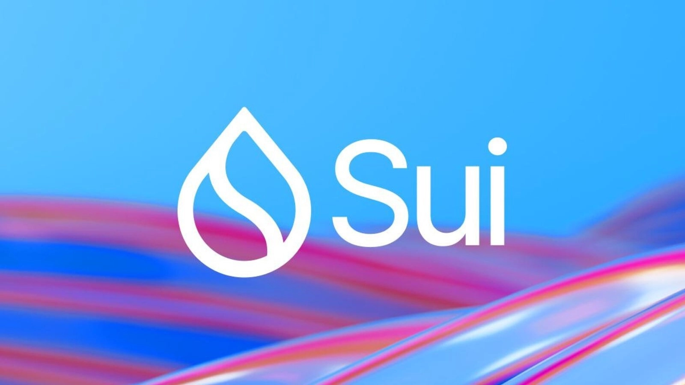
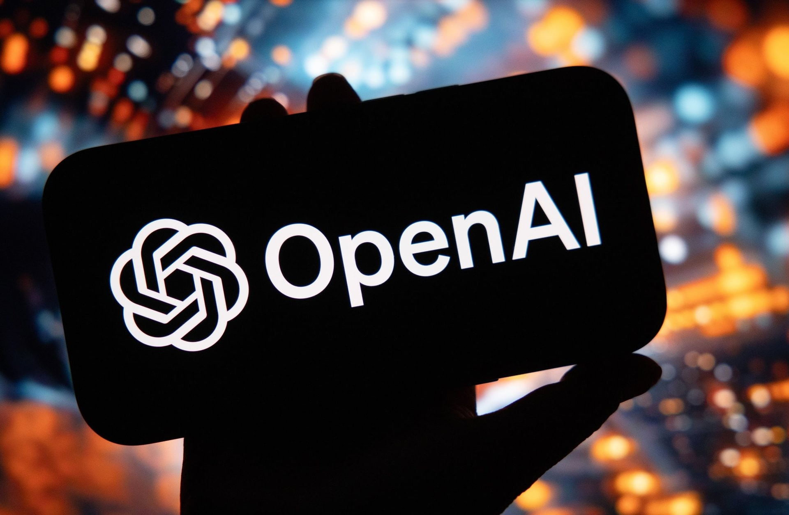
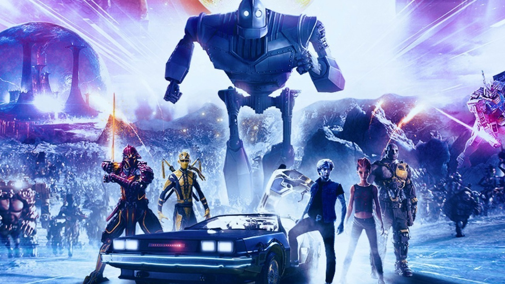
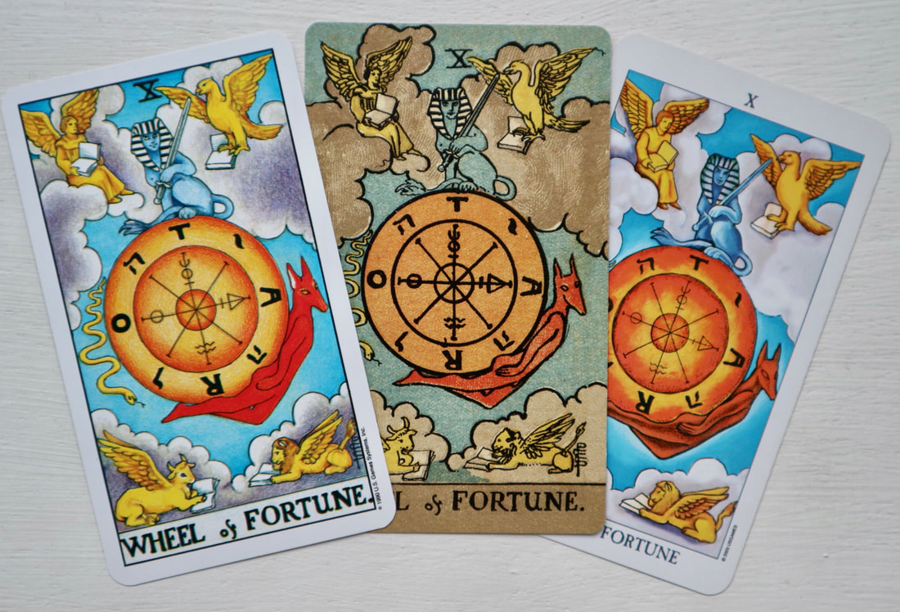

Trump đã làm tổng thống kế tiếp của Hoa Kỳ, ông đang bắt đầu phát triển nội các của mình, phần lớn là những người có xu hướng ủng hộ Crypto.

Dù muốn dù không, thế giới chúng ta đang sống đang đứng trước một bước ngoặc cực kỳ quan trọng. Bốn năm tiếp theo sẽ góp một phần quan trọng trong việc định hình lại trật tự thế giới trong nhiều thập kỷ tiếp theo.

Chưa bao giờ mình cảm thấy hào hứng đến vậy. Bài viết này, nhằm chia sẻ những nhận định của mình, và cũng là một sự chuẩn bị cho bản thân trước những thay đổi có khả năng diễn ra trong thời gian tới.

## RWAs và sự bùng nổ thanh khoản cho DeFi

RWAs chính là việc mã hoá tài sản ở thế giới thực và đưa lên blockchain. RWAs (NOBLE, ONDO, OM - Mantra) nổi lên trong một năm gần đây, và khả năng cao đây sẽ là từ khoá được nhắc đến nhiều trong những năm tiếp theo.

Khi một tài sản được đưa lên blockchain, một trong những nhu cầu phổ biến nhất đó chính là biến nó trở thành tài sản thế chấp. Khi đó những đơn vị cho vay sẽ đóng vai trò in tiền (AAVE, SAVE, SCA), giống như cách mà ngân hàng truyền thống đang hoạt động. Thông qua đó sẽ làm bùng nổ thanh khoản trên các ứng dụng DeFi (UNI, RAY, JUP, CETUS).

Số lượng tài sản thực lớn hơn rất nhiều so với giá trị của toàn bộ thị trường crypto hiện tại. Như vậy, chắc chắn lượng stablecoin đang lưu hành hiện tại sẽ không thể nào đáp ứng được nhu cầu mạnh mẽ của thị trường. Đây chính là thời điểm vàng để các stablecoin phi tập (SKY/USDS) hay stablecoin thuật toán (USTC) phát huy sức mạnh của mình.

Khi điều đó xảy ra các Oracles (LINK, PYTH, TRB) sẽ đóng một vai trò cực kỳ quan trọng để duy trì sự ổn định và tính an toàn của toàn bộ thị trường crypto.

[HBO_HOTD_MetaImage_map.avif](T%C3%A2n%20th%E1%BA%BF%20gi%E1%BB%9Bi%20RWA,%20ETH,%20SOL%20v%C3%A0%20qu%C3%A2n%20c%C3%A1ch%20m%E1%BA%A1ng/HBO_HOTD_MetaImage_map.avif)

## Thế chân vạc định hình thế giới Crypto trong tương lai

Lúc nào cũng vậy, sự hỗn loạn sẽ dần trở nên bớt hỗn loạn hơn, và thu về thế chân vạc để khống chế, hỗ trợ lẫn nhau, giống như cách Tam Quốc hình thành vậy.

Sẽ có rất nhiều blockchain tồn tại song song với nhau, mỗi blockchain đóng một vai trò nhất định. Tuy nhiên, khả năng cao, người dùng cuối sẽ thường xuyên tương tác với 3 blockchain chính: ETH, SOL, và SUI.

Dẫu vậy, thế giới phi tập trung sẽ luôn bị kiểm soát bởi những thành phần giàu có, ngoại trừ BTC.

### **ETH - Ether**

Với lịch sử lâu đời, và số lượng đồ sộ các ứng dụng được phát triển trên ETH. Trong tương lai gần ETH vẫn sẽ là tượng đài lớn trong thế giới crypto. Tuy nhiên, ngôi vương này có thể bị lung lay bất cứ lúc nào, bởi 2 đối thủ đáng gờm đó là SOL và SUI.

Với sự hiện diện của ETH ETF, hiện tại ETH đang có lợi thế thu hút dòng tiền từ thị trường truyền thống, tuy nhiên khoảng cách sẽ sớm được rút ngắn khi mà SOL ETF, hay SUI ETF được ra mắt. Có thể bạn chưa quên, chỉ đầu năm 2023 khoảng cách của ETH và SOL là rất lớn. Nhưng giờ đây SOL chỉ cần x4 là có thể vượt mặt ETH. Khi không còn ở ngôi vương, câu chuyện tiếp theo sẽ diễn ra rất nhanh và chóng vánh.

Với sự ra đời của vô số các layer-2, mỗi layer-2 được quảng cáo là thiết kế cho một mục đích nhất định, tuy nhiên về tổng thể sẽ không có sự khác biệt nhiều. Vì tất cả đều dựa trên ETH. Đều bị giới hạn bởi những ưu và nhược điểm của ETH.

Các layer-2, là ưu thế, tuy nhiên cũng là nhược điểm chí mạng của ETH. Nó làm cho thanh khoản trên ETH bị chia 5 sẻ 7, rất khó để bày các game lớn. Do đó, mình đoán, vị thế độc tôn của ETH sẽ dần bị SOL và SUI rút ngắn lại, khi các ETFs tương ứng được ra mắt.

### SOL - Solana

SOL đối thủ trực tiếp của ETH. Với việc phát triển bằng ngôn ngữ cấp thấp Rust, cộng với sự phân tầng rõ ràng cho lớp dữ liệu và lớp xử lý. SOL đủ linh hoạt, và khả năng để xử lý tất cả các ứng dụng tài chính phức tạp nhất.

Tuy nhiên, Rust khá khó tiếp cận, dẫn đến việc các ứng dụng phát triển các ứng dụng trên SOL tốn rất nhiều tài nguyên và chi phí. Do đó, đây vẫn sẽ là mảnh đất được quản lý bởi các nhà tài phiệt, những tổ chức lớn, các đối tượng có nguồn lữ và tài chính dồi dào. Đây thực sự là mảnh đất mà các tổ chức truyền thống rất ưa chuộng.

Đội ngũ của SOL cực kỳ thông minh và nhạy bén, họ không chỉ là tập hợp của những developer tài năng, mà còn là những nhà hoạch định chiến lược xuất sắc. Chính SOL là nền tảng đầu tiên mở màng phòng trào MEME coin. Bonk từ $8M lên hơn $4B ở thời điểm hiện tại không phải là do may mắn. 

Có thể nói, tài nguyên con người của SOL chính là nhân tố khiến nền tảng này trở nên vững chắc trong các thay đổi nhanh chóng của thời cuộc. 

### SUI

SUI, chính là quân cách mạng, là mảnh ghép còn thiếu trong miếng bánh thị phần crypto. Sinh sau đẻ muộn, khi mà thế giới crypto cơ bản đã bảo hòa. Tuy nhiên, SUI học được những cái hay và tiết chế được cái dở của đối thủ, để có thể nhanh chóng lấy được thị phần đủ lớn về cho mình.

Trong khi việc publish một ứng dụng lên SOL hay ETH tốn đâu đó tầm 1000$ tính theo giá hiện tại, với giá này, sẽ làm chùn bước của bất kỳ nhà phát triển cá nhân nào. Về lâu về dài, việc sở hữu các ứng dụng phi tập trung sẽ nằm trong tay những nhà tài phiệt, những đơn vị lớn có nhiều nguồn lực.

SUI lại khác, với việc sử dụng ngôn ngữ Move, ngôn ngữ được thiết kế dành riêng cho việc phát triển các smartcontract, và các ứng dụng tài chính, có độ tin cậy cao. Làm cho việc đóng gói một ứng dụng SUI rất nhẹ, dẫn đến chi phí khi deploy một ứng dụng lên blockchain rất rẻ, chỉ tương ứng với một giao dịch trên ETH hay SOL thôi. 

Với những yếu tố đó, SUI sẽ trở thành một mảnh đất màu mỡ cho sự sáng tạo, nơi bất kỳ nhà phát triển ứng dụng nào, với 1$ họ đã có thể publish ứng dụng của họ. Các ứng dụng trên SUI sẽ nhờ đó mà thú vị, và đa dạng hơn rất nhiều.

SUI có tốc độ nhanh, có thể nói là nhanh nhất trong các blockchain hiện nay, TPS - 297.000. SUI có cách tổ chức dữ liệu độc đáo, làm tăng tính sở hữu của người dùng đối với dữ liệu. Hệ sinh thái của SUI cơ bản đã hoàn thiện, tất cả những ứng dụng phổ biến ở ETH hay SOL, SUI cũng đều đã có những đối trọng tương ứng.

SUI hội tụ đầy đủ các yếu tố để trở thành một SOL tiếp theo, hiện tại chỉ cần chờ một cú hích cực lớn từ thị trường (SUI ETF), hoặc một cú sẩy chân từ đối thủ để có thể chiếm lấy nhiều thị phần hơn.

## Ngoại truyện

Bên dưới là những nhận định rời rạc, liên quan tới những chủ đề khá nóng ở thời điểm hiện tại: AI, Crypto Games, Vàng và Dầu.

### AI

Trong các bộ phim khoa học viễn tưởng, chúng ta đã từng không ít lần nghe nói tới AI sẽ chiếm lấy thế giới. Một trong những viển tưởng AI mất kiểm soát, và trở nên mạnh mẽ sẽ như thế này.

AI sử dụng BTC làm đơn vị tiền tệ của chính nó, sử dụng RUNE để hoán đổi thành ETH hay các Token nển tảng khác, thông qua đó sử dụng các pool thanh khoản của UNI, RAY, CETUS để hoán đổi thành các token càn thiết để trả phí. 

AI deploy mã nguồn của nó lên FIL/AR protocol. Sau đó execute nó trên RENDER/IO. Tất cả các hành động trên AI đều có thể thực hiện được mà không thể bị ngăn chặn bởi bất kỳ cá nhân hay tổ chức nào. 

AI khó có khả năng bùng nổ trong chu kỳ này. Vì sự thiếu an toàn của nó, mà nhiều chính quyền có thể sẽ ngăn cản, làm chậm tốc độ phát triển của nó như nó vốn là. Và vì sức hút của RWAs thực sự quá lớn.

### Blockchain Games, Play-to-Earn

Blockchain games có khả năng sẽ phát triển cực thịnh ở giai đoạn này, những game đình đám như minecraft chỉ cần phát triển thêm module blockchain thì có khả năng sẽ tạo ra một cú hích cực lớn đối với thị trường này. Mình tin rằng, xã hội sẽ phát triển nhanh hơn những gì mình có thể tưởng tưởng được.

Nếu ai đã từng xem Ready Player One thì có thể hình dung được thế giới game blockchain trong tương lai sẽ hoạt động thế nào. Nếu bạn kiếm được tiền trong game, thì ở ngoài đời bạn cũng sẽ giàu có. Cái này đã từng xảy ra với AXL rồi, và sẽ phát triển mạnh mẽ hơn nữa dưới thời tổng thông Trump. 

### Vàng, Dầu và Năng Lượng Hạt Nhân

Cái bắt tay của Trump và Elon khả năng cao sẽ làm cho: Dầu rớt, Vàng rớt. Vì người ta sẽ đi xe điện và tích trữ BTC. Đó sẽ là cú sốc cực lớn đối với những người đã quá quen với sự hiện diện của vàng và dầu trong cuộc sống.

Khi mà BTC trở nên phổ biến hơn bao giờ hết, năng lượng để duy trì hệ thống trở nên một vấn đề nóng hơn bao giờ hết. Người ta sẽ phải tìm đến một giải pháp mới, năng lượng hạt nhân. Lúc này, điện trở nên rẻ và dồi dào hơn bao giờ hết. Cuộc chạy đua năng lượng hạt nhân bắt đầu. 

Những liên minh cũ sẽ tan rã, những liên minh mới sẽ hình thành. Biết đâu OPEC sẽ biến mất, thay vào đó là PNEC (Peaceful Nuclear Energy Consortium) - Tập đoàn Năng lượng Hạt nhân vì Hòa bình. Chuyên đi bán Uranium và đánh những quốc gia nào dám tự ý sản xuất nguyên liệu này.

Thế giới bước sang trang mới.

Hỗn Loạn - Nguy Hiểm - và Khó Kiểm Soát. 

Hoặc cũng có thể là,

Hòa Bình - An Toàn - và Hiệu Quả.

🍍🍍🍍

Nhưng dù thế nào đi nữa, thì cũng phải đá bát phở cho ấm lòng trước cái đã.
