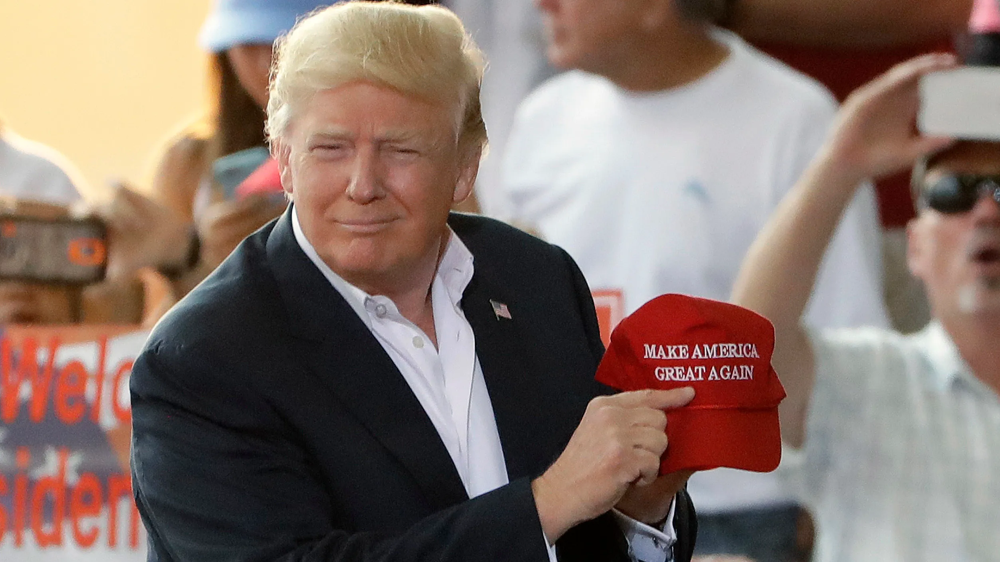

Hey, it's him again. Whoever you are, man or woman, wherever you live, whatever your philosophy or political views: like it or not, you cannot escape the dark power of the US dollar. The dollar has woven itself into every corner of our daily lives.

With the loose alignment of global superpowers, combined with the rise of Crypto and AI in recent years, the US dollar is facing its final battle. A conflict that will usher human history into a new, exciting, and far more grand era: the New World.

### History of the US Dollar

The US dollar was born in 1913, originally backed by gold. By 1971, the dollar abandoned the gold standard and became backed entirely by US public debt. If you look closely, you will notice that the US dollar is very different from most other fiat currencies in the world. While most fiat is issued and managed by governments, the US dollar is managed by the Federal Reserve (FED): a private corporation.

In most countries, from the old European continent to nations established after World War II, the nation comes first, and the central bank follows. In the US, it is the opposite: the bank came first, and the nation followed. The banks and the shadow forces behind them control the US, and through the US, they project control over other nations and individuals.

The British pound dominated the world before being replaced by the dollar. Now, the dollar has reigned for over 100 years. Is it time for the world to welcome a new common currency?

### Make America Great Again

A few years ago, during Trump's presidency starting in early 2017, his campaign was centered around making America great again. The most prominent action was bringing manufacturing jobs back from China to the US. This action sent China into an unprecedented crisis, dragging its economy down: by early Q4 2023, the Chinese stock market had hit bottom.

However, this move indirectly weakened the dollar's dominance. In the long run, having fewer US companies in China gives China a massive opportunity to escape the dollar's influence. China expanded its Belt and Road Initiative and developed new alliances like BRICS to reduce dependency on the US and the dollar.

Trump unintentionally fractured the dollar's power, releasing a wild beast into the open ocean.

### The Final Battle

Never in US history has a presidential candidate dared to openly challenge the power of the dollar. The last president who dared to do so was John F. Kennedy, who was promptly assassinated in 1963. This created a historic feud between the Kennedy family and the shadow elite of American politics.

Interestingly, during his 2017 term, Trump always claimed to protect the dollar. But this time is different. Could it be that the power of the masters behind the dollar has been shaken? If Trump wins, it could mean the shadow elite has abandoned control over the dollar, or their strength is no longer enough to dominate US politics. Or perhaps they intend to control the world in a different way: through Crypto and AI.

Even before becoming president, Trump survived at least two assassination attempts. If Trump survives his four-year term, it will likely mark the end of the dollar's 100-year hegemony: a moment when the oldest powers on Earth begin to relinquish their grip on the current world order. The soft power balance that maintained global stability for decades will be let loose for the first time.

The world will enter a new era: the Era of Chaos, the New World.

### The Era of Chaos: The New World

Without the dollar's dominance, a massive power vacuum will appear on the stage of history. New revolutionary forces will form, and new coalitions of justice will develop rapidly.

Those who adapt quickly during this phase will lead the New World for decades to come. The year 2030 could mark a turning point in human history:
- The world is no longer dependent on oil
- Energy is money, and whoever controls energy rules the world
- New coalitions of justice will emerge
- Among them, Bitcoin, Crypto, and AI are an inevitable part

### The 2024 US Election: Trump vs. Harris

The US presidential election is nearing its end, and the cards will be shown on the first Tuesday of November. On November 5, 2024, we will know who will lead the US for the next four years. According to statistics on Polymarket, Trump leads Harris by an impressive margin.

He doesn't bet on Harris winning this election. After all, the US remains a country with deep racial divides. It will be very difficult for the American public to accept a woman of color leading them. Although Obama was the first Black president, at that time, the US economy was devastated by the 2007 housing bubble and the stock market had hit bottom in 2008: Obama became president in that exact context.

This time is different. The US stock market is at an all-time high, and the economy may not enter a recession by late 2024 or early 2025. Thus, accepting a woman of color as president becomes harder than ever for the public.

However, he would feel very surprised if Trump wins, for one single reason: Trump dares to oppose the dollar, even before officially taking office.

### The Simpsons' Prophecy

In an episode aired in 2000 titled \"Bart to the Future,\" *The Simpsons* shocked viewers by predicting Donald Trump would become president. In that episode, Lisa Simpson becomes president and mentions that her administration faces a severe financial crisis left behind by the Trump presidency.

This may not have been about 2018: it could be referring to 2024. Trump rises to the presidency, shakes the world for four years, and then leaves a chaotic world to Harris. She would then only need two years to collapse it by 2030: beginning a new page in human history.

🍍🍍🍍

If possible, see you in the New World!

*❤️ cowriter aethery*
