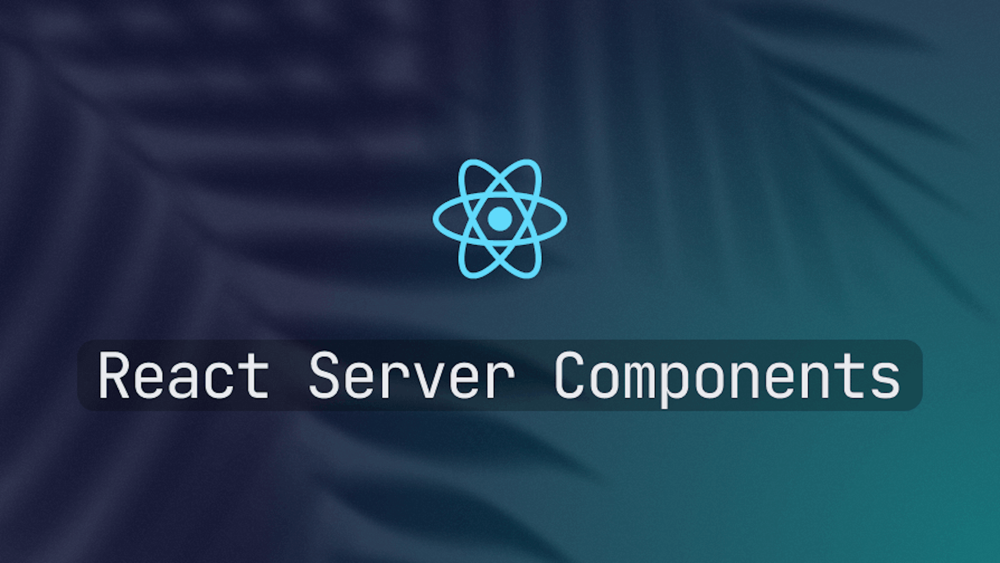
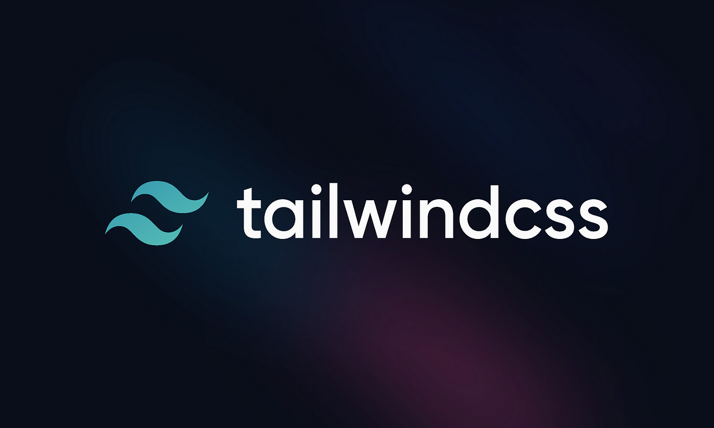

Chúa tể hắc ám Voldemort đã từng qua lời Quirrell, nói:

"There is no good and evil. There is only power, and those too weak to seek it."

Một vài năm trước, hắn biết đến Vercel là một cậu lính mới, giúp host vài website react đơn giản. Tuy nhiên, bẵng đi một thời gian, Vercel phát triển với tốc độ chóng mặt, khiến hắn không thể phớt lờ sự hiện diện của tổ chức này. Tìm hiểu sâu hơn một chút, hắn nhận ra rằng ở Vercel không chỉ có, NextJs, Turbo, v0, hosting,... mà đây còn là một hệ tư tưởng, một giáo phái và là có thể đây còn là một thế lực hắc ám, theo định nghĩa của Lord Voldemort.

Đây có thể là một bài viết phức tạp, outline này sẽ khiến mọi người đỡ lầm đường lạc lỗi

- Sự ra đời đầy mờ ám của RSC
- Mối lương duyên đen tối giữa Nextjs - React và Tailwind
- Con Ace chủ bài - v0.dev
- Sự công khai đối đầu với những gã khổng lồ - Google, Cloudflare
- Tương lai nào cho React

## Sự ra đời đầy mờ ám của React Server Components - RSC

Từ lúc ra đời tới bây giờ, react luôn được hiểu là phần View ở client, vậy mà giờ đây react lại cho ra đời React Server Components. Và lạ thay sự ra đời của RSC lại được NextJS tiếp cận rất nhanh, như có sự chuẩn bị từ trước. Thoạt đầu, hắn nghĩ đây chỉ là sự vô tình. Nhưng tìm hiểu sâu mới biết đây lại là hữu ý. Khiến hắn lo sợ về mối lương duyên đen tối này.

RSC không chỉ là một tính năng mới. Nó là một cuộc cách mạng, nhưng cũng là một cuộc thanh trừng. Những thư viện từng là trụ cột của hệ sinh thái React như styled-components, hay các giải pháp CSS-in-JS, bỗng chốc trở nên lạc hậu, không tương thích với mô hình server-centric của RSC. React rẽ sang một hướng đi mới. Hướng đi mà kẻ có lợi nhất chính là NextJs mà đằng sau đó chính là Vercel.

React, từng là biểu tượng của sự tự do, giờ đây dường như đã bán một nửa linh hồn cho quỷ dữ.

## Mối lương duyên đen tối giữa Next - React và Tailwind

Next.js, React, Tailwind - một bộ ba hoàn hảo, một kiềng ba chân vững chắc, hay một chiếc vòng kim cô đang siết chặt thế giới web? Mối quan hệ này không chỉ là kỹ thuật, mà là một âm mưu lớn hơn, một hệ tư tưởng đang định hình lại cách lập trình viên nghĩ và làm việc. Vercel không chiếm thế giới bằng vũ lực. Họ gieo rắc một triết lý: đơn giản, nhanh chóng, và phụ thuộc.

Next.js giờ không còn là một framework bình thường. Nó là một giáo phái, nơi các lập trình viên bị cuốn vào vòng xoáy của sự tiện lợi, nhưng cũng mất đi quyền tự do lựa chọn. Vercel không ép bạn, nhưng họ khiến bạn cảm thấy không chọn họ là một sai lầm. Lập trình viên giờ đây phải đứng trước ngã rẽ: hoặc là Vercel, hoặc là Netlify, Firebase, AWS. Mỗi lựa chọn là một tuyên ngôn, một lời thề trung thành với một hệ sinh thái, ảnh hưởng sâu sắc đến cách họ xây dựng web trong tương lai.

Hắn từng đùa rằng, ở Việt Nam, dân chủ là khi bạn được tự do bỏ phiếu, nhưng chỉ có một ứng viên duy nhất. Liệu mối lương duyên này có dẫn đến một tương lai mà Vercel là lựa chọn duy nhất?

## Con Ace chủ bài - v0.dev

Nếu Next.js, React, và Tailwind là bộ ba quyền lực, thì v0.dev chính là lưỡi dao sắc bén hoàn thiện âm mưu của Vercel. Với vài dòng prompt, hoặc một bản thiết kế từ Figma, v0.dev có thể tạo ra những website chất lượng cao trong chớp mắt, tất cả đều dựa trên Next.js, React, và Tailwind. Đây không chỉ là một công cụ. Đây là một lời tuyên chiến với cách làm web truyền thống.

Lập trình viên, những kẻ từng mơ về siêu năng lực, giờ đây được v0.dev trao cho sức mạnh thần thánh. Những tính năng mà trước đây cần cả team cày cuốc hai sprint mới xong, giờ chỉ cần vài cú click. Kết hợp với Cursor hay Windsurf, v0.dev biến lập trình viên thành những bậc thầy sáng tạo, nhưng cũng khiến họ phụ thuộc hơn bao giờ hết vào hệ sinh thái của Vercel.

Hắn nhìn v0.dev, và thấy một tương lai nơi các website đều mang dấu ấn của Vercel - đồng nhất, hiệu quả, nhưng thiếu đi sự đa dạng. Liệu đây là đỉnh cao của sự tiến bộ, hay là bước đầu tiên hướng tới một thế giới web độc tài?

## Sự công khai đối đầu với những gã khổng lồ - Cloudflare, Google

Vercel không chỉ dừng lại ở việc xây dựng công cụ. Họ đang thách thức cả những gã khổng lồ. Với CDN và Analytics của mình, Vercel dám đối đầu trực diện với Google Analytics và Cloudflare. Có người bảo: “Nhưng Segment cũng có Analytics, đâu có gì lạ?” Đúng, nhưng Segment nhắm vào thị trường ngách, còn Vercel? Họ muốn thống trị thị trường đại chúng, nơi Google và Cloudflare đang ngự trị.

Hoặc Vercel quá ngây thơ, hoặc họ có hậu thuẫn từ những thế lực đủ sức đối chọi với các gã khổng lồ. Hắn nghiêng về vế sau. Vercel hiểu rõ: kẻ nào kiểm soát Edge, là kẻ kiểm soát thế giới. Với CDN và Analytics - Vercel đã khẳng định tham vọng thống trị thế giới web của mình. Vercel không chỉ vận hành, mà con đo lường thế giới web. Và để chuẩn bị cho một trận chiến vĩ đại với những gã khổng lồ cổ xưa - Google, Cloudflare. Vercel có đang phát triển cho mình vũ khí tối thượng?

## Tương lai nào cho React

React, từng là ngọn cờ đầu của sự đổi mới, giờ đây đang đứng trước bờ vực. Sau khi bán linh hồn cho Vercel, React mất đi sự trung lập, mất đi sức hút với những nhà phát triển độc lập. Sự ra đi của các thư viện lớn như styled-components, cùng với sự thất vọng của cộng đồng trước RSC, là dấu hiệu cho một tương lai u ám.

Dễ nhận thấy sự rời bỏ dần dần của các nhà phát triển. Họ không còn nhìn React như một biểu tượng của tự do nữa. Một bước tiến lớn từ các framework khác như Svelte hay Vue, hoặc một cuộc cách mạng từ WebAssembly, có thể bỏ lại React ở phía sau. Trong tưởng lai gần hắn không làm việc với react, nên hắn giao phó sự thành bại của React cho ý trời.

Hắn thích một tương lai có nhiều lựa chọn. Còn bạn?
