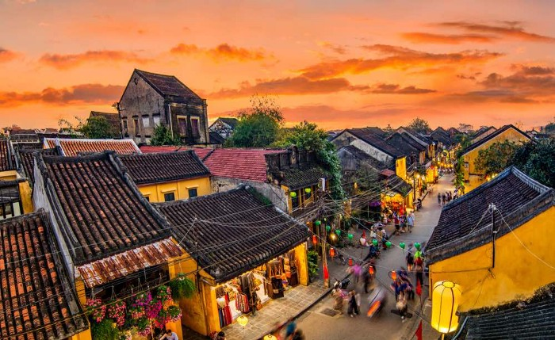
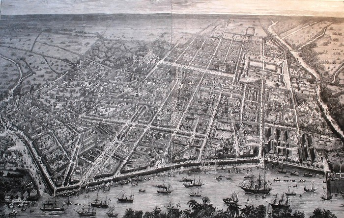

Hey, it's him again. This article is based on 10% truth, the rest is beer, mixed with the hyped mood of just finishing part 2 of Money Heist. Consider carefully before reading.

## Mainland War: China and the US

Americans always like to measure the size of a war by the number of American soldiers who have died. Until now, if we don't count the Civil War, the number of wars that killed American citizens on American soil can be counted on one hand: the most recent being the terrorist attack on 9/11, and a little further back, the Battle of Pearl Harbor.

People often mention Pearl Harbor not because of its size, but because of the unexpected and bold actions of Japan. The US has always been confident that America will never be a battlefield for any war. Neither the North nor the South are their opponents, and both are protected by the two largest oceans on the planet. Pearl Harbor is in America, but it is a remote island in Hawaii, more strategic than economic. From Pearl Harbor to the mainland, there is still a long way to go, much like traveling from Hanoi to Hue, and then from Hue to Gia Dinh.

Therefore, Americans always believe that America is the safest place on earth. It is the last place where communism can reach. But in just the past month, the number of Americans who died on American soil is almost equivalent to the number of American soldiers who died in the Vietnam War, a war that America participated in for 25 years. And the number is still increasing, with the number of people infected at the moment equal to the number of people who died in World War II: 770,564 people. For the first time since its founding, New York has become completely deserted, and the United States has declared a state of emergency across all states at the same time. For the first time, the advanced defense systems of the United States have become extremely useless. The United States seems not as powerful as they thought, and they will radically change their perception of war from now on.

After this round, the already cold economic relationship, with the added caution of unforeseen dangers from China, will likely lead the US government to encourage their companies to leave China as a national defense measure, just like what Samsung did. This is something that will happen sooner or later. But where will they go? Vietnam.

## Vietnam: An Ideal Destination for US Companies

They will come to Vietnam because Vietnam has the necessary conditions to allow US companies to move here without too much difficulty. This is due to the following reasons:
- Vietnamese people are smart, hardworking, not afraid to learn, and have the ability to adapt very quickly: quick and synchronized like the way they faced Covid, while Vietnam is not only politically stable but also fully capable of dealing with unpredictable impacts from both nature and humans
- Vietnamese and Chinese cultures are quite similar, so what companies are applying in China can be applied in Vietnam
- There are abundant resources, and they can take advantage of the proximity to the border with China to import additional raw materials
- The presence of many American companies in Vietnam will help the US increase its presence in the South China Sea, where 50% of the world's cargo volume flows through and where the US, China, and Russia all want to raise their influence, which is also a measure to curb China's growth

## And the Pearl of the Far East Will Shine Again?

If Vietnam, Cambodia, and Laos are not just three Indochinese countries, but become an economic and political alliance (called VCL, which stands for a very strong alliance), then when the potential of agriculture and industry in Cambodia and Laos is combined with the human resources and large seaports of Vietnam, this alliance can completely make breakthroughs of value in the region.

Vietnam is not only the center of the VCL alliance, but also the focus of the JKV economic axis: Japan, Korea, Vietnam (not JAV, Japan's indoor entertainment industry). When the industrial strength of Japan is combined with the vast amount of money from Korea and the huge potential of Vietnam, letting the Pearl of the Far East shine again like it used to is entirely within reach, and this time it will definitely be more stable and last a lot longer.

Moreover, when this duo alliance is completed, if G7 representatives support the US by limiting trade with China, then China will be cut off from the western heartland, and its continental power will be reduced by half. With the five hundred VCL brothers and the JKV justice alliance playing a security role in the South China Sea, coupled with the support of NATO, China's sea lanes will be restricted. That is the scenario that the US may want to happen. It is also a great opportunity for Vietnam in the coming years.

🌱🌱🌱

Ps: What has he prepared to deal with similar things that will happen in the future? He doesn't hope that life will be peaceful: he just hopes to be good enough to steer himself to his desired destination, whether the future is rough or calm.

*❤️ cowriter aethery*
