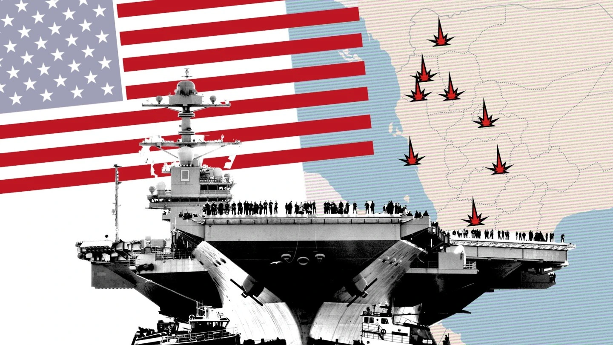
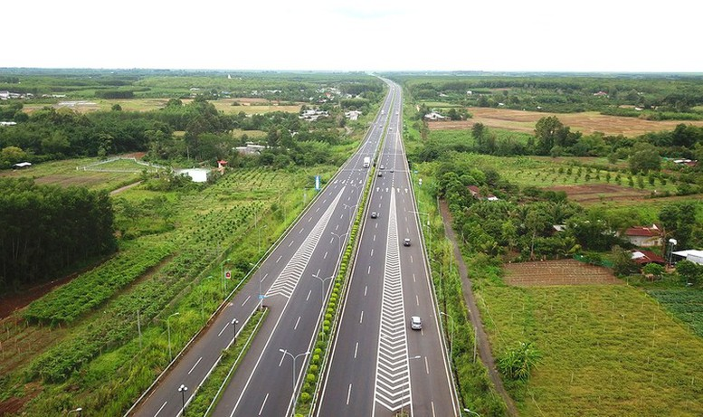
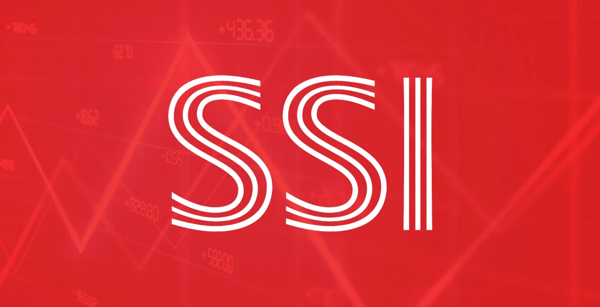

Không phải suy thoái kinh tế, không phải sự va chạm của các cường quốc, cũng chẳng phải sự phát triển thần tốc của AI, mà chính sự già hoá dân số mới là quả bom hẹn giờ lớn nhất mà các quốc gia đang phải đối mặt.

Nhật Bản và Hàn Quốc đã gần như chấp nhận thua trận trong cuộc chiến chống già hóa. Trung Quốc hiện cũng đang bước vào chu kỳ này, với tỷ lệ sinh giảm mạnh đến mức dù có xoay sở kiểu gì, cũng khó đảo ngược tình thế. Họ đang ra hàng loạt chính sách để vực dậy dân số, nhưng cùng lúc lại chịu đủ thứ áp lực từ bên ngoài lẫn bên trong. Mà đặc biệt, cái "vòng kim cô" mà Trump sắp đặt lên Trung Quốc có thể khiến họ chệch hướng phát triển trong nhiều năm tới.

Việt Nam lại đang có một lợi thế rất lớn, nhưng không thể tự nhiên hưởng thụ lợi thế đó mà không giải quyết bài toán dân số. Chính phủ đã có những bước đi mạnh dạn, từ nghị định 166 hỗ trợ chi phí cho sinh viên ngành giáo dục, đến những biện pháp hạn chế rượu bia, cấm các chất kích thích, tất cả đều nhằm mục tiêu cải thiện chất lượng giống nòi. Và cú chốt gần đây nhất: miễn học phí cho học sinh từ cấp 1 đến cấp 3 trên toàn quốc. Họ đang làm mọi cách để không chỉ khiến dân số tăng lên, mà còn tạo tiền đề để thế hệ sau có nền giáo dục tốt hơn.

Vấn đề là, liệu những biện pháp này có đủ để kéo dài thời kỳ dân số vàng và tận dụng được cơ hội trong trật tự thế giới mới?

## **Trump: Hòa bình hay trật tự đơn cực?**

Thế giới hoà bình mà Trump muốn tạo ra không phải là một thế giới cân bằng, mà là một thế giới mà chỉ có nước Mỹ là vĩ đại, còn những nước khác thì cứ tầm tầm bậc trung là được rồi. Bằng cách làm suy yếu các đối thủ, giữ các đồng minh trong trạng thái phụ thuộc và nắm quyền kiểm soát cán cân xung đột, Mỹ sẽ là trọng tài tối thượng, nước nào đánh nhau thì Mỹ can thiệp, nhưng theo hướng có lợi cho Mỹ.

Với chiến lược này, trong nhiệm kỳ tiếp theo, Trump có thể sẽ:

- Siết chặt Trung Quốc để hạn chế sự trỗi dậy của họ
- Bóp nghẹt châu Âu để Mỹ duy trì thế thượng phong
- Giữ Nga ở trạng thái "không mạnh cũng chẳng yếu" để kiểm soát được cục diện chính trị toàn cầu
- Thu phục Canada và Mexico, biến Bắc Mỹ thành một khu vực ảnh hưởng kinh tế của riêng Mỹ

Trong bối cảnh đó, Mỹ sẽ cần một trung tâm sản xuất thay thế Trung Quốc, và Việt Nam chính là ứng viên sáng giá nhất. Đây có thể là nhân tố chính thúc đẩy sự phát triển mạnh mẽ của Việt Nam trong những năm tới, miễn là chúng ta tận dụng được thời cơ.

## **Nâng hạng thị trường và cấu trúc lại dòng vốn**

Ai cũng biết rằng giá bất động sản cần phải được giảm, nhưng nếu giảm quá nhanh, nền kinh tế có thể gặp chấn động. Hiện tại, tín dụng ở Việt Nam phụ thuộc rất lớn vào bất động sản. Nếu giá nhà đất lao dốc đột ngột, sức mua toàn thị trường sẽ suy giảm, doanh nghiệp sẽ khó khăn, và hệ quả là nền kinh tế bị kéo chậm lại.

Lối thoát duy nhất chính là **nâng hạng thị trường chứng khoán**, thu hút dòng vốn từ nước ngoài. Khi dòng tiền ngoại đổ vào chứng khoán, doanh nghiệp có thể huy động vốn dễ dàng mà không cần phải vay thế chấp bằng bất động sản. Dần dần, vai trò của bất động sản trong hệ thống tín dụng sẽ giảm bớt, giúp thị trường tự hạ nhiệt mà không gây ra cú sốc.

Đây chính là mục tiêu mà các nhà hoạch định chính sách đang nhắm đến. Nếu làm tốt, Việt Nam có thể tiếp tục duy trì lợi thế dân số trẻ, tránh được cái bẫy mà Trung Quốc đang mắc phải.

## **Cao tốc Bắc – Nam và hình thành các khu đô thị mới**

Muốn khuyến khích sinh đẻ, trước hết phải giải quyết được vấn đề nhà ở. Một thế hệ trẻ ổn định về chỗ ở thì mới yên tâm lập gia đình, sinh con.

Với sự phát triển của đường sắt cao tốc Bắc, Nam, hàng loạt khu đô thị mới sẽ hình thành dọc theo tuyến đường này. Đi kèm với nó là sự phát triển của **nhà ở xã hội**, giúp tầng lớp lao động có cơ hội sở hữu nhà với giá hợp lý hơn. Nếu triển khai thành công, đây sẽ là một yếu tố quan trọng để giữ cho dân số Việt Nam tiếp tục trẻ và dồi dào.

Mất đi giai đoạn này, chúng ta có thể rơi vào tình cảnh như Trung Quốc hiện tại, già trước khi giàu, và đến lúc nhận ra thì đã quá muộn.

Trong vài năm tới, "nhà ở xã hội" sẽ là một cụm từ được nhắc đến liên tục trên các phương tiện truyền thông. Và nếu xét về đầu tư, có lẽ **các công ty phát triển hạ tầng mới là những bên đáng chú ý hơn là doanh nghiệp bất động sản truyền thống.**

## **Hành động của chúng ta**

Vậy giữa tất cả những biến động này, có thể rút ra được gì?

- **Thay vì đầu tư vào các công ty bất động sản**, hãy chú ý đến **các công ty phát triển cơ sở hạ tầng** và **xây dựng**
- **Dịch vụ vận tải & logistic** sẽ phát triển mạnh, khi nền kinh tế cần một hệ thống chuỗi cung ứng bền vững hơn
- **Những công ty sản xuất** có thể lên ngôi, vì Mỹ đang tìm kiếm một đối tác thay thế Trung Quốc
- **Chứng khoán bùng nổ**, nhờ dòng vốn nước ngoài đổ vào khi Việt Nam được nâng hạng thị trường

Tóm lại, cơ hội lớn đang mở ra, nhưng đi kèm với nó là những thách thức không nhỏ. Nghe lời hắn, lời lỗ bạn tự chịu. Đọc tới đây rồi, đã thoải mái có một đứa con gái chưa người đẹp?
