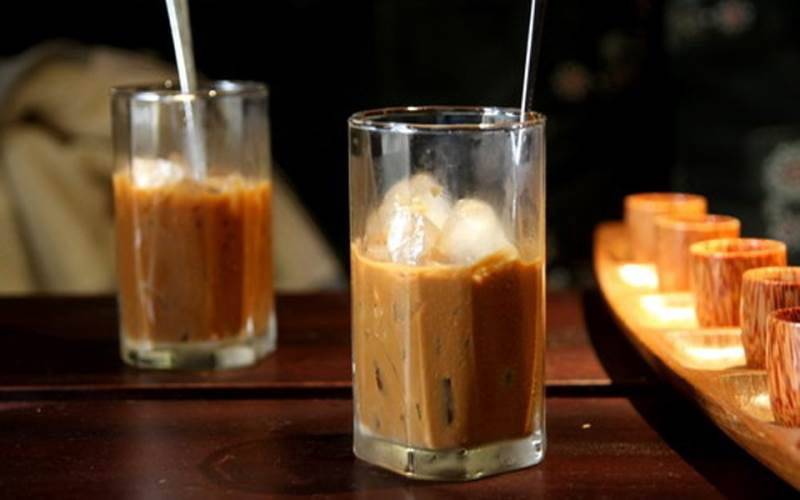
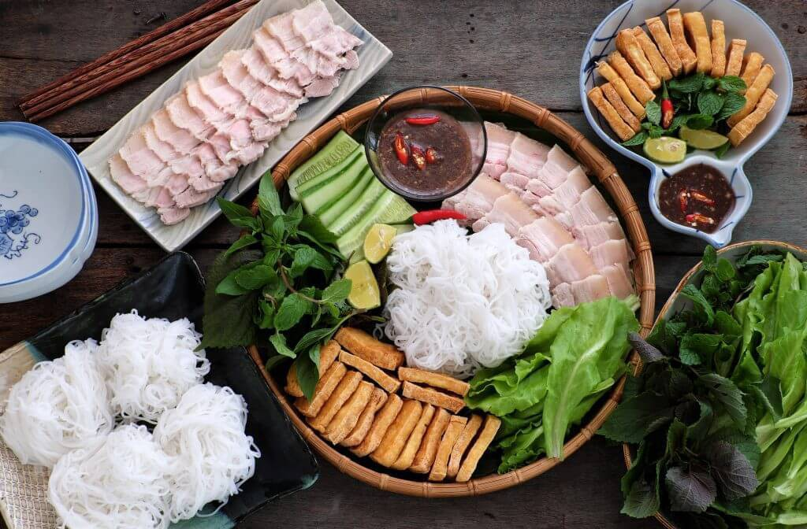
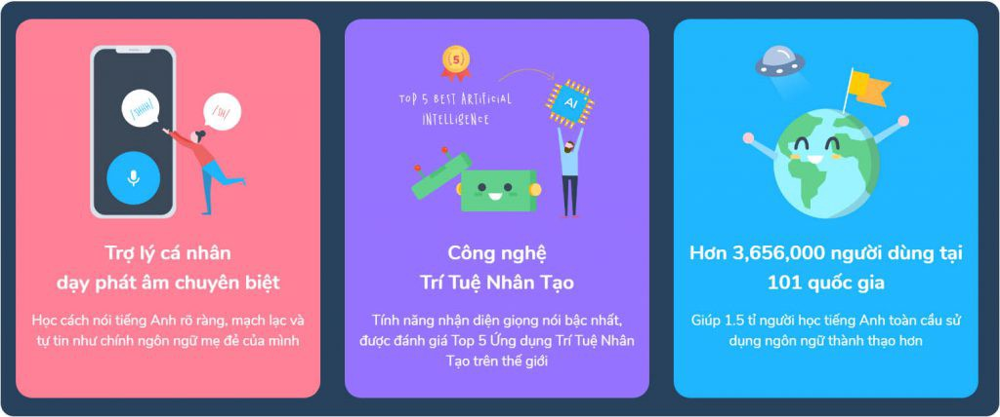

Hey, it's him again. In fact, many years ago, he never felt comfortable about April 30th, but now his perspective has changed a lot. He doesn't want to call today Liberation of the South Day: he just wants to call it Unification Day.

If we talk about unifying the country, Emperor Nguyen Anh accomplished it over 200 years ago, from 1802 onwards. He is sure that over 200 years ago, when Emperor Nguyen unified the country, there were certainly many people who were happy and many who were sad. However, for him, unification is a good thing: it gives people the opportunity to be united and strong, even if it may take a lot of time.

For him, Vietnam has always been a special nation: not only in the past and present, but also in the future.

## Vietnam has the Quoc Ngu Script

A nation that has been under the domination of the North for over 1000 years, through many dynasties and ups and downs. It even underwent the largest cultural purge in history at that time. The Vietnamese language was heavily influenced by Chinese civilization, just like Japan and Korea. However, in the end, we built a system of letters and language structure in a civilized and modern way. Compared to English with many exceptions, modern Vietnamese is much more advanced.

## Vietnam has Ca phe sua da

He used to drink Ca phe sua da a lot, and his coffee experience has changed over time. Now he limits sugar, so he switches to Americano. But for him, if pho is the national dish, then Ca phe sua da is the national drink of Vietnam.

There is no other place in the world where they drink coffee like the way Vietnamese people drink coffee, coffee brewed with condensed milk. But that is also what makes the coffee experience here unique.

A little bit of history: Vietnam can grow coffee, but cannot grow much Arabica because it is not suitable for our climate. Arabica requires more strict conditions compared to Robusta, and Arabica's ability to resist pests and diseases is much lower than Robusta. Because of this, more than 95% of coffee in Vietnam is Robusta, which also shapes the way Vietnamese people enjoy coffee in a different way.

Robusta has more caffeine than Arabica, but in return, the taste and aroma of coffee is not as diverse as Arabica. Therefore, Vietnamese people consider coffee as a refreshing drink, like a starter for a conversation. As for other countries, they see coffee as a drink to savor, like the difference between iced tea and tea.

Yes, what about iced tea, what about Ca phe sua da. It's cool and trendy, right? That's why he is sure that foreign coffee brands like Starbucks will never be able to become the majority in Vietnam. In Vietnam, they only stop at brand recognition and inspiration.

## Vietnam has the most advanced fast food system in the world

He watches American movies: every time he sees them order food, if it's not pizza, it's fried chicken. Unhealthy eating habits make a large part of the population not well-balanced in weight. Vietnam is different: most Vietnamese dishes meet the yin and yang balance, the balance of vegetables and meat, like balut with rau ram. The cold nature of balut will be balanced by the hot nature of rau ram. Or like Pho: with vegetables, meat, and rice, it looks balanced. There are some people who eat Pho without onions, and it doesn't look flavorful at all.

Along with the belief that everyone is a master, every household is a master, the number of small restaurants in Vietnam is very diverse. Since you don't have to spend too much money on dining out, many single people eat out almost every day of the week. If you are in another country, this will be very expensive.

With the diversity of dishes, as well as the abundance of restaurants, it will be a huge barrier for foreign brands to enter the Vietnamese market. For example, McDonald's or Jollibee, they have been in Vietnam for a long time, but their impression on him is quite dull. Vietnam is a market that is very different from the rest of the world.

## Vietnam invests heavily in education

He is not sure about this, but he believes that there is no other country where parents from urban to rural areas care about their children learning English as early as they do in Vietnam. The number of English language centers in Ho Chi Minh City is even more than the number of convenience stores, as he often jokes. Then his Korean or Japanese friends are surprised.

When we have invested a lot of money to do something, sooner or later we will reap a lot of results. He believes that, in just a few years, Vietnam will be an exporter of tools to help improve learning around the world, and Vietnam will be a very fast mover in digital transformation in the field of education. Like Elsa Speak, Topica Native, or most recently 1On1English.

*❤️ cowriter aethery*
