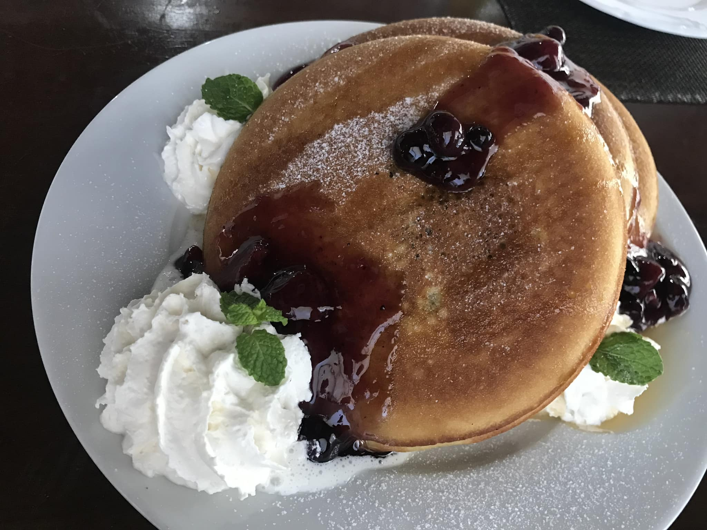

Hey, it's him: untold stories until now: the time Eimi visited Vietnam and secretly went up to Kon Tum to meet him

Back in 2019, he went to Cebu to study English, where he met her. She went there to prepare for a long business trip to the US

He and she were in the same class: he liked her for her pure and gentle beauty. She was attracted to his rugged, dusty look of a wanderer who had roamed the streets for many years. The two went on dates

Hearing that she liked going to the top, he risked emptying his pockets to hire a taxi to the highest mountain peak in Cebu. The drive took two hours. From high above, the city looked so small. She babbled on about her work, life, and deep humanistic philosophies

She liked eating pancakes, and she often made them herself every morning. He just kept listening to her, thinking about the next peak he needed to conquer. She asked him what he liked to eat: startled, he answered goat meat: goat, torrential goat...

When she came to Vietnam this time, he told her he was no longer in Saigon but had moved to Kon Tum. He thought she would not come because of the bumpy roads, yet she still arrived. He was surprised. Standing before his door, she still had that naive look from the early days. No matter what, she would always be his little sister

This time, he took her to Chu Reng Mountain, camping up there for the night: incredibly exhausting: eating chicken stewed with chili, drinking Y Uyen straw wine which was absolutely amazing. She said it was hard to forget him, and after that night she would miss him even more. He knew she was just being polite, as Japanese people usually are

She returned to continue her work as an actress. He remains here, diligently telling futile stories. Truly, affinity is decided by heaven, but fate is held by humans. He knows that when they meet again in the future, she will still want to go to the top with him, and he will always spoil her

*❤️ cowriter aethery*
