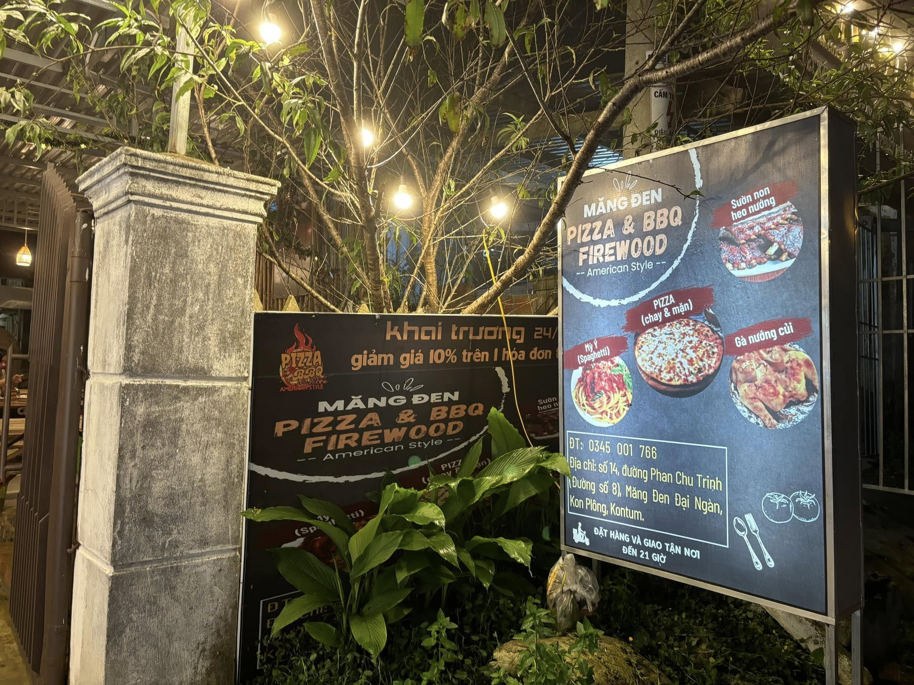
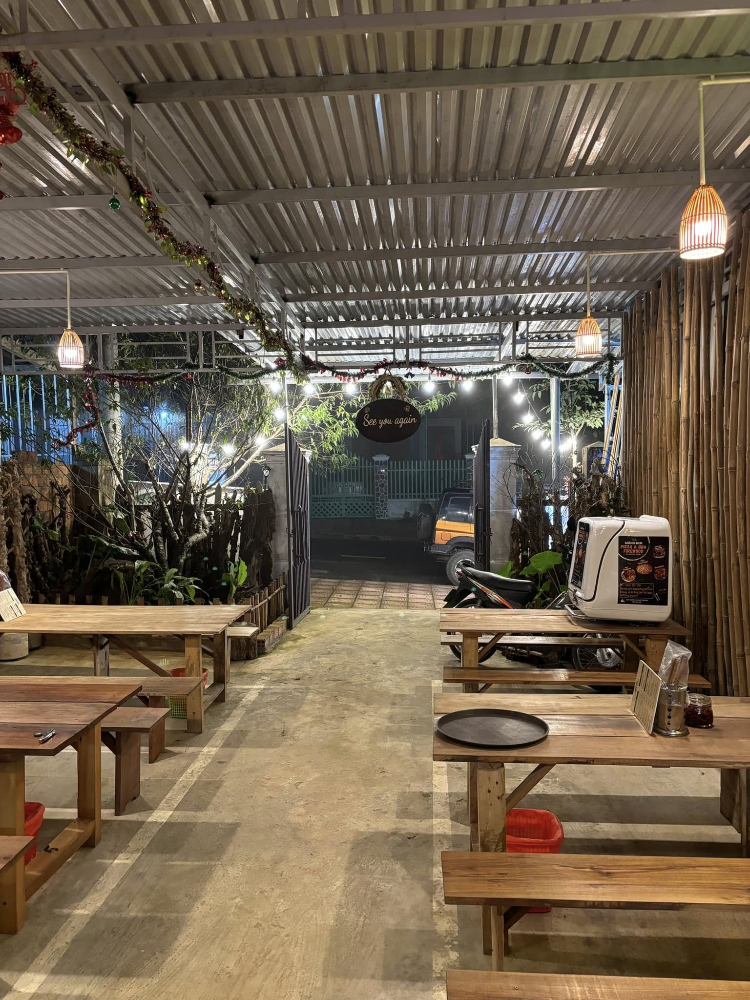
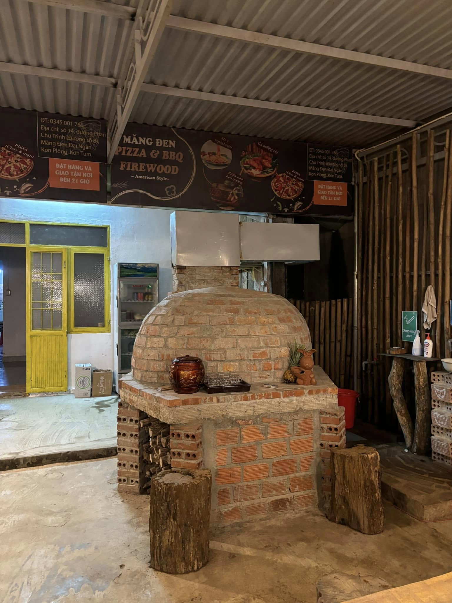
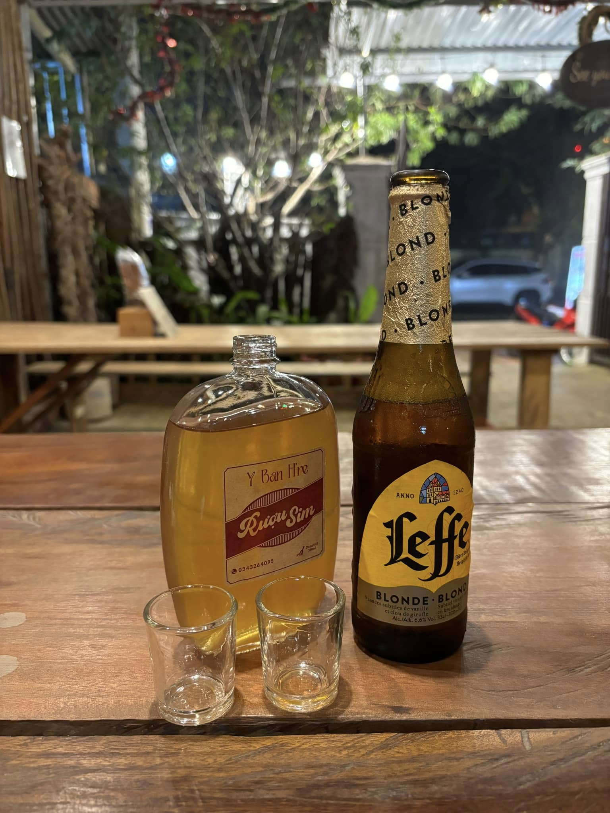

Hey, lại là hắn đây, hắn lại đi chữa lành. Cái mặt dày của hắn có bao nhiêu cái thẹo, là trái tim hắn lại bấy nhiêu lần bị cứa sâu.

Nhớ đâu đó năm 2019 hắn lang thang ở Lạc Dương, Langbiang, thì bắt gặp một tiệm Pizza. Những chiếc bàn gỗ dài, gỗ vụn, nhưng gọn gàng ngăn nắp. Chiếc lò nướng được đắp thủ công, chỗ vuông chỗ tròn, nhưng lò thì lúc nào cũng ấm lửa. Hắn bị cuốn hút bởi những thứ như vậy.

Anh chủ quán là một người ngoại quốc, tên James, vợ là người Việt. Anh có một cô con gái nhỏ, tóc vàng, đáng yêu cực. Giờ chắc con anh cũng tuổi teen rồi. Hắn luôn ước mình có một cô con gái như vậy. Hắn nghĩ, sau này hắn dẫn con gái hắn đi shopping, cho thiên hạ trầm trồ.

Lằn này, hắn ngủ 1 đem ở Hana Homestay. Đặc sản ở măng đen là mưa rừng, bê cực.

Gần đấy, đập vào mắt hắn. Những chiếc bàn gỗ dài, ngăn nắp, cho hắn cảm giác ấm cúng gần gũi biết bao. Hắn gọi Pizza, khoai tây chiên, rượu và bia. Hỏi ra mới biết, chú Tuấn, là bạn cũng là học trò của chú James. Sao trái đất lại tròn đến vậy? Hắn nghĩ.

Cuộc đời hắn đã ăn rất nhiều cái bánh Pizza rồi, bánh của chú Tuấn chỉ xếp sau Pizza 4’ps thui. Hôm đấy hắn ăn nhiều.

