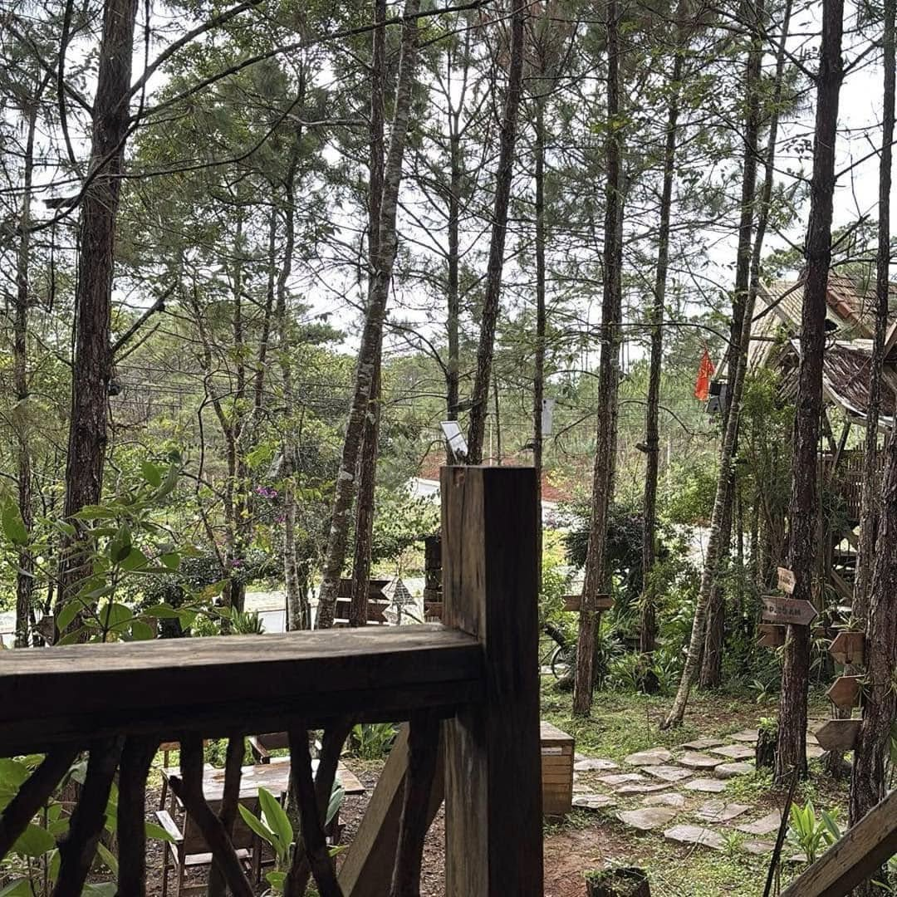

Hey, lại là hắn, chú bốn, kẻ mà có gì hay ho, thì chẳng bao giờ giấu trong quần, để dành cho riêng mình, mà luôn muốn đem share.

Hắn lại lên măng đen, chẳng phải để chữa lành gì cả, hắn chỉ muốn giết thời gian thôi. Ngày mưa rả rích, còn gì bằng nếu ngồi dưới hiên nhà của Sóc House, ngắm mưa, nhìn 2 con chó đực vờn nhau, uống vài ly rượu táo mèo, nhâm nhi vài điếu thuốc.

Thời gian chậm lại. Hắn nghĩ, giá như bên cạnh hắn lúc ấy, không phải là Dũng, thằng bạn thân thời đại học, mà là Thị, thì chắc chắn hắn đã không màng tới rượu, thuốc hay mưa rồi, thậm chí hắn cũng sẽ chẳng có thời gian quan tâm tới là chó đực hay cái. Hắn sẽ bận rộn đo đi đo lại xem 4.5 gang tay nó to bằng chừng nào. Thị làm hắn nghiện.

Hắn đói, hắn ghé quán lẩu gà lá é - Nậu Tui, quán mà hắn đã có dự định đến từ lâu. Vì là ngày trong tuần, quán vắng. Quán nhỏ, bài trí đơn giản, trên bàn cũng chỉ có 2 lọ gia vị, muối tiêu và nước mắm. Chị chủ dễ mến, tất nhiên là không thể nào so với Thị của hắn rồi.

Lẩu gà rất ngon, thịt gà trắng như cặp giò của Thị vậy, gà chị chia ra không quá to mà cũng không quá nhỏ, ngoài ra có nấm và lá é nữa. Chỉ vậy thôi mà làm hắn mê lắm luôn. Không biết tại sao, hắn luôn thích những thứ đơn giản, có vậy thì vẻ đẹp của món ăn chính mới được bộc lộ rõ ràng, chắc vậy.

Hắn và Dũng ăn sạch, lẩu 200k cho 2 người, không còn hình để mà up luôn. Té ra, những điều bình thường mà có hình bóng của Thị đều đầy đặn đẹp đẽ hơn hẳn.

