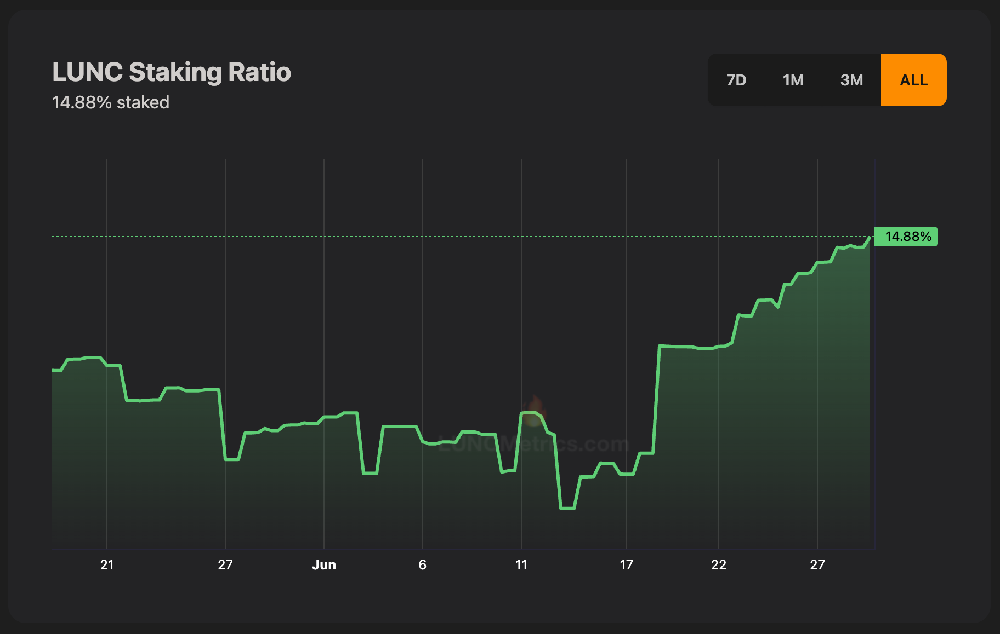
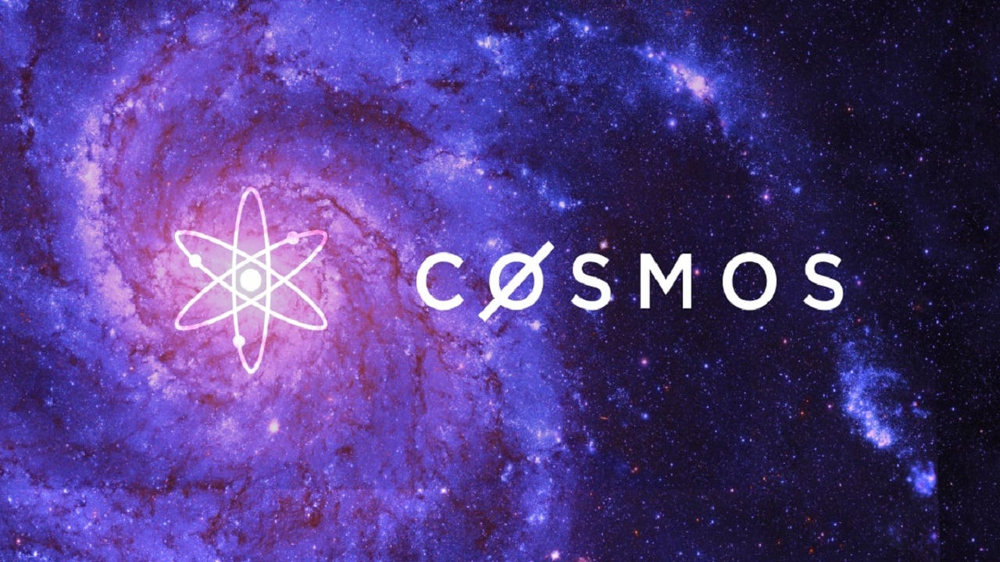
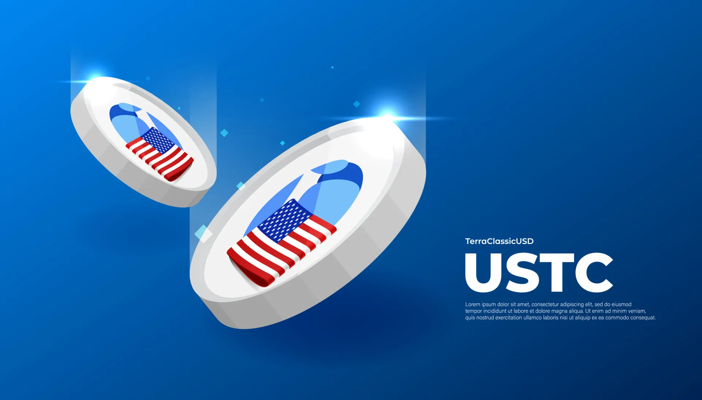
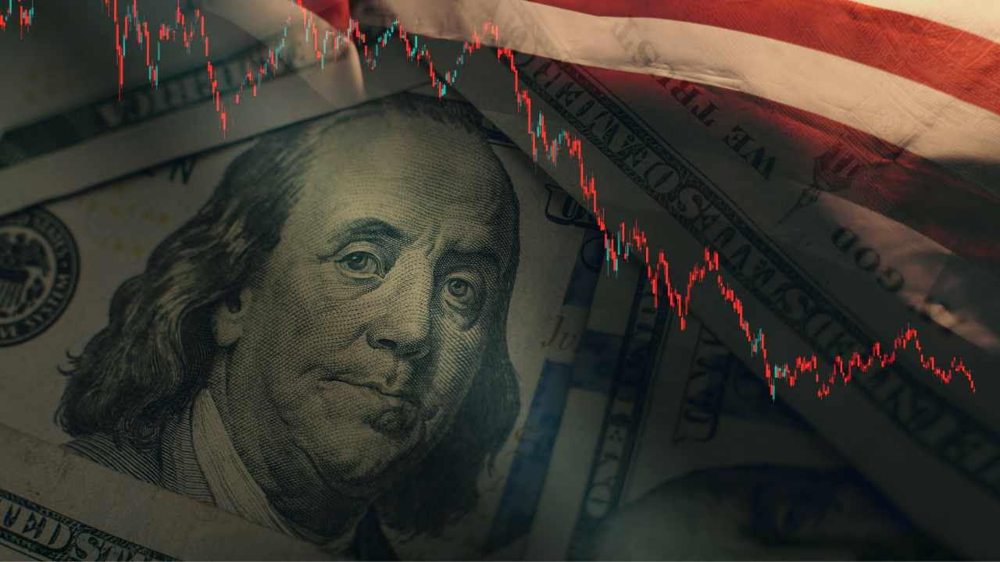
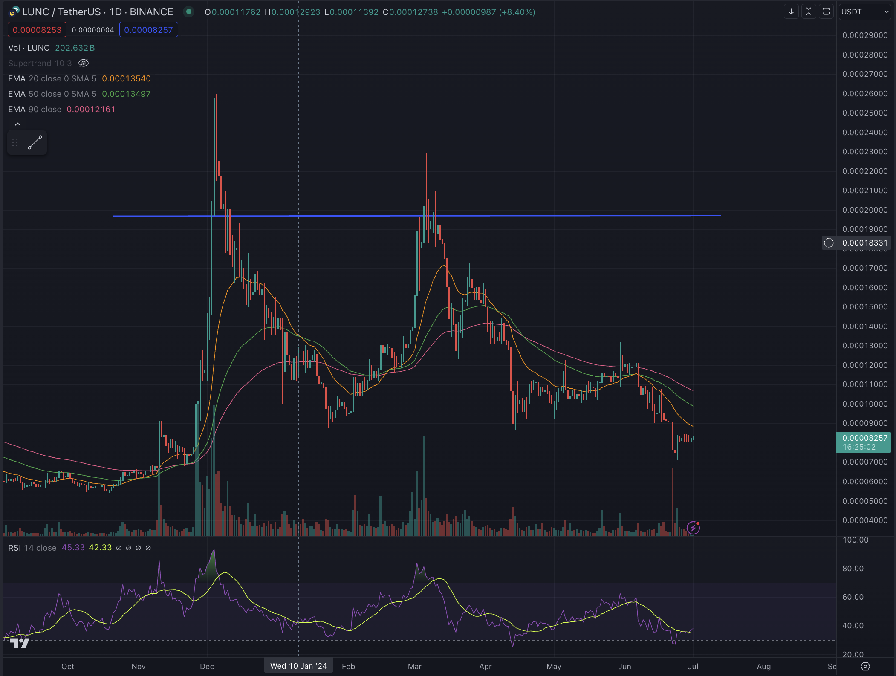

Hey, it's him again. LUNC: the grand collapse, the sleeping beast waiting to rise again, stronger than ever.

If you were in the market in 2022, you probably didn't miss the 100 billion USD collapse of LUNC. Let's find out if this token still has a chance for the upcoming bull run.

### Token Distribution

LUNC was born from a beautiful, grand idea, failed due to human greed, and its structure might rise once more as it finds the right timing, environment, and support.

Before the crash, the majority of tokens were held by early investors and whales. But after the collapse, with the massive printing of new LUNC tokens, many retail investors could access it. It is estimated that more than 5 million people hold LUNC in their private wallets. LUNC seems to have achieved the distribution necessary for exponential growth.

If you ask anyone in crypto whether they know LUNC, he guesses most would know it and its collapse. The hope of a resurrection is LUNC's greatest value right now.

Currently, Terraform Labs (TFL) has declared bankruptcy and completely abandoned control of LUNC by burning all USTC and LUNC in their wallets. This is excellent for LUNC in the long term, as the ownership of LUNC has become completely decentralized and community-owned, much like BTC. All future upgrades rely on community consensus. LUNC will no longer face lawsuits and can no longer be defeated by a single entity.

Currently, more than 1,000 billion LUNC have been staked, representing about 15% of the total supply. At LUNA's peak, the staked ratio was around this level: a clear sign that a massive number of people still believe in LUNC.

### The Platform

LUNC is built on COSMOS, a blockchain designed to interact with other blockchains automatically. This built-in interoperability makes moving assets from other chains to LUNC more natural and secure.

If you observe closely, USTC is integrated across many platforms. Part of the reason is that COSMOS makes integration simpler and safer than traditional cross-chain bridges. Other blockchains developed on COSMOS include ATOM, KAVA, and INJ.

Recently, LUNC upgraded IBC-Hooks (Inter-Blockchain Communication), promising to improve interactions with other chains and unlock more potential on the existing platform. Hopefully, more hope will follow soon.

### The Secret Weapon: USTC

USTC is LUNC's ace card, which other Cosmos-based chains lack. The automated mint and burn mechanism makes LUNC stand out from the rest. This is the greatest value of the platform, the very mechanism that helped LUNA explode in the previous cycle, and it is what will help LUNC explode again, stronger than ever, in the future.

### The Position of LUNC and USTC in the Crypto Market

Stablecoins play a vital role in the crypto market. A platform cannot grow if its stablecoin supply is not large enough to serve its users.

LUNC and USTC can act as the stablecoin provider for entire blockchain ecosystems due to LUNC's built-in multi-connectivity.

Imagine a time when LUNC holders earn yield from maintaining the stability of USTC minting, much like government bondholders. LUNC and USTC would then become the decentralized central bank of the crypto world.

### What Happens When the Dollar Devalues?

The development of LUNC is connected to the popularity of the dollar, so what happens if the US dollar devalues?

Nothing bad happens, because if the USD devalues, users will need to mint more USTC, which in turn drives up the price of LUNC.

He considered this deeply before deciding to invest in LUNC. Once this question was resolved, he became completely confident in LUNC's bright future.

### The Price Plan

When the price returns and stabilizes at 0.00195, hope for a massive outbreak will resume. This could be when USTC bridges become active again, providing the push to bring USTC back to 1 USD. When USTC repegs to 1 USD, LUNC will be fully revived. All that is needed next is time.

The best time to buy LUNC is when the price of USTC is below 0.2. See you when USTC repegs.

*❤️ cowriter aethery*
