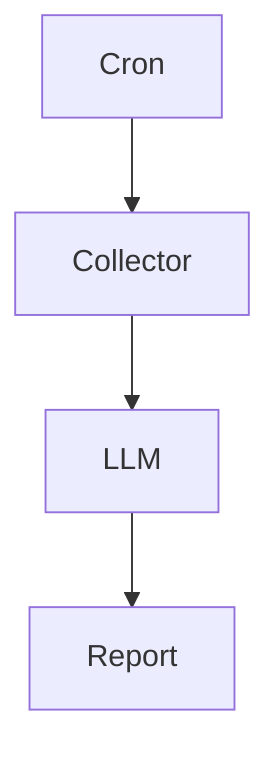
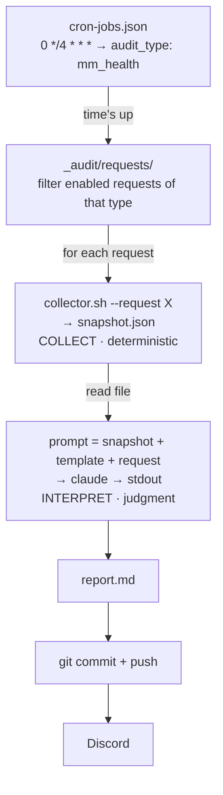

Hey hey, it's him again.

There is something interesting about working with AI. A lot of people want AI to become an all-purpose employee. They give it permission to query databases, read logs, call APIs, SSH into servers, decide what data is still missing, and only then produce a conclusion. Sounds very smart, very "agentic". But the more systems he builds, the more he feels this is not good architecture. Not because AI is not capable enough, but because we are asking it to do two completely different jobs. One is finding the truth. The other is interpreting the truth.

Those two jobs look similar at first glance, but their natures are almost opposite. Collecting data needs to be fast, precise, and produce the same result every run. Interpreting data is the opposite: it needs reasoning, connection-making, and room for different angles. If you force one agent to do both at once, it becomes very hard to know whether a wrong conclusion came from the AI's reasoning, or simply because the input data was already wrong.

That is why, in Djao Trading's market-making audit system, he deliberately split these into two fully independent pipelines. The collector does exactly one thing: take a photo of the system at a moment in time. The LLM also does exactly one thing: read that photo and form a judgment. Nothing more. Nothing less.



## Overall architecture

Look closer, and a full audit loop looks like this.



At first glance the diagram looks ordinary. But the most important part is not Claude, GPT, or Gemini. What is worth keeping is the boundary between layers. Cron only answers "when to run". The request answers "what to check". The collector answers "what the system looks like right now". The LLM only answers "is that okay". Each layer has a single responsibility, and they talk to each other through one fixed snapshot.

## The collector is only allowed to observe

This is probably the most important decision in the whole system. Most people's first instinct is to give AI full agency. Want logs? Go read them. Want a database query? Run it. Missing data? Call another API. The more autonomous, the better. He went the opposite way. The collector is not allowed to think. It is only allowed to observe.

The reason is simple. When AI fetches data itself, you lose reproducibility. An 8am run and a noon run can look at the system in two different ways. If the report is wrong, you almost cannot know exactly what the AI saw. Every reasoning loop also burns more tokens, more time, and more cost, while the data-fetching part should be fast and cheap. More important still, collection errors and interpretation errors get tangled together. Sometimes you waste half a day only to discover the AI misunderstood nothing: someone just wrote the wrong SQL.

So he drew a hard line between deterministic and non-deterministic. The collector only photographs the truth and packages it into a JSON file.

```bash
#!/usr/bin/env bash
set -euo pipefail

request="$2"; out="$4"
account=$(parse-audit-request.sh "$request" account)

jq -n \
  --arg account "$account" \
  --argjson positions "$(psql -tAc "SELECT ... WHERE account='$account'")" \
  --argjson quotes   "$(curl -s "$API/mm/quotes?acc=$account")" \
  --argjson funding  "$(curl -s "$API/funding/upcoming?acc=$account")" \
  '{collected_at: (now | todate), account: $account,
    positions: $positions, quotes: $quotes, funding: $funding}' \
  > "$out"
```

The scheduler only calls the collector, waits for the snapshot to appear, and stops if there is no result.

```ts
this.exec(
  `bash "${script}" --request "${req.path}" --output "${snapshotPath}"`,
  typeDef.collectorTimeoutMs,
);

if (!existsSync(snapshotPath)) {
  this.logger.error(`Snapshot missing: ${snapshotPath}`);
  return;
}
```

There is no AI in this layer at all. Only code, databases, and APIs. Fast, cheap, and the same result every time.

## The audit request is the prompt

There is something he really likes about this architecture. The prompt does not live in code. It is not hardcoded into a string hundreds of lines long. Each audit is simply a Markdown file.

```markdown
---
id: mm-health-pavn
enabled: true
account: pavn-main
audit_type: mm_health
---

# Market Making Health

Please check:

- Is the spread tracking target?
- Is inventory skew above threshold?
- Does upcoming funding add more risk?
```

At first glance it looks like an ordinary config file. The frontmatter helps the scheduler know when this audit runs, for which account, and where to send the report. But the important part is below. The lines a human writes are what the AI will read. In other words, an audit request is really a prompt stored in git.

He likes this far more than stuffing prompts into source code. Want the AI to care more about funding? Edit a few lines of Markdown. Want to drop inventory or change how spread is judged? Edit that same file. No rebuild, no deploy, no IDE. The prompt has become data, and like source code it has history, diffs, reviews, and can roll back to any version.

He thinks this is the most interesting point in the whole system. Many people treat a prompt as just a string passed into an LLM. In this architecture, the prompt is treated as an official system document. The collector is responsible for producing the truth. The prompt decides what the AI must care about. The template decides how the AI must present it. When those three pieces are separated, each can evolve independently without breaking the others.

## The snapshot is a witness

Many people think a snapshot is only input for the AI. For him, it is also a witness.

Three weeks later, if the AI concludes that inventory skew crossed an abnormal threshold, he does not need to rebuild the database, replay logs, or guess what the AI saw. He only opens that day's exact snapshot. The AI is only allowed to see what was photographed. Nothing more. Nothing less.

So the snapshot is stored with the report and committed to git.

```text
_audit/
├── cron-jobs.json
├── requests/
├── reports/
│   └── 2026/07/19/
│       ├── mm-health-pavn.snapshot.json
│       └── mm-health-pavn.md
```

The collector commits that this is the full truth at time T. The LLM commits that every conclusion is based on exactly that photo. The snapshot becomes the contract between the two layers of the system.

## AI is only allowed to read

Only after the snapshot exists does AI appear. Even then, he keeps its permissions very tight. AI may not query the database. May not call APIs. May not SSH into a server. It receives exactly three things: the snapshot, the template, and the audit request.

```ts
const snapshot = readFileSync(snapshotPath, 'utf8');
const template = readFileSync(templatePath, 'utf8');

const prompt = typeDef.buildPrompt({
  req,
  snapshotJson: snapshot,
  template,
});

const result = await this.aiExecutor.execute(
  prompt,
  'claude',
  AUDIT_TIMEOUT_MS,
);
```

The template matters as much as the snapshot. Without a template, today the AI writes a table, tomorrow prose, the day after it invents new sections. With a template, the output is stable enough for other systems to keep processing. The final report always links back to the request and snapshot that produced it. If a conclusion looks suspicious, open the snapshot and you know what the AI saw.

## The rest is just operations

After the report is produced, the system commits to git, pushes to the repository, then sends it to Discord. Sounds simple, but there is still a very ordinary problem: preventing overlapping runs. If one audit loop runs longer than its cycle, two processes can easily write to the same place.

```ts
if (this.running) return;
if (this.isLockHeldByOtherLiveProcess()) return;

this.running = true;
writeFileSync(LOCK_FILE, String(process.pid));

try {
  // run audit
} finally {
  this.running = false;
  execSync(`rm -f ${LOCK_FILE}`);
}
```

The more interesting part is the stale lock. If a process dies mid-run, the lock file stays and the whole system sits forever. He uses a tiny trick.

```ts
process.kill(pid, 0);
```

This line kills no process. It only asks the OS whether that PID is still alive. If it is, yield. If it is dead, clear the lock and continue. One line, but enough to turn a system that hangs easily into one that can heal itself.

## This pattern is not only for trading

The example in this post is market making, but the skeleton works in many places. A collector can query a database, read logs, call APIs, run `kubectl get`, or `terraform plan`. An audit request can talk about SLAs, cloud cost, data quality, or security. The LLM can be Claude, GPT, or any other model. Discord can become Slack, email, or PagerDuty.

Any job where every day you open a dashboard, read data, and form a judgment yourself can fit this model.

## Closing

After finishing this system, he realized AI does not need to become an operating system. It also does not need to replace humans in the search for truth.

AI is best at something else: finding meaning in truths that already exist. Finding the truth belongs to the collector, the database, and the code that runs every day. Finding meaning is where AI actually earns its keep.

Once those two jobs are split, everything becomes much simpler. Today's collector can be Bash; tomorrow it can be Go or Rust. In a few years Claude can be replaced by a completely new model. But the snapshot remains.

It is the pledge between the two layers of the system. One side says: "This is the full truth I saw." The other answers: "Then let me tell you what this photo is saying."

*❤️ cowriter aethery*
