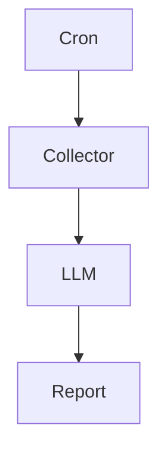
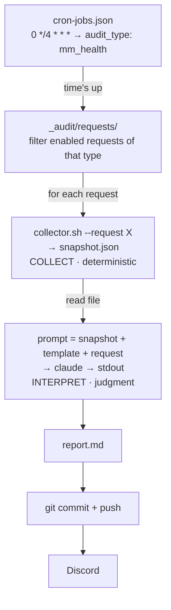

Hey, it's him again.

One of the most common mistakes when building an AI agent is giving it everything to do: query the database, read logs, call APIs, decide what extra data it needs, and only then conclude. Sounds very "agentic." But the more he built this way, the more he felt it wasn't good architecture. Not because the LLM isn't smart enough, but because it's doing two completely different jobs: collecting data and interpreting data.

Those two jobs have almost opposite requirements. Collection needs to be deterministic, reproducible, fast, and cheap. Interpretation needs reasoning, flexibility, and contextual understanding. Mix both into one agent and you lose nearly all the benefits of each.

So in Djao Trading's market-making audit system, he deliberately split them into two fully independent pipelines. The collector is only responsible for producing a **snapshot**. The LLM is only responsible for reading that snapshot. Nothing more. Nothing less. The architecture looks like this:



## Detailed architecture

Zoom in, and the same loop looks like this:



Four layers, four cleanly separated responsibilities:

| Layer | The question it answers | Its nature |
|-------|-------------------------|------------|
| **Cron** | *When does it run?* | schedule, lives in a config file |
| **Request `.md`** | *What to check?* | declarative, not code |
| **Collector `.sh`** | *What's the current state?* | deterministic, no AI |
| **LLM** | *Is it okay, and why?* | judgment, never fetches data itself |

The insight is in the **separation**, not in being able to call an AI.

## Design Decision #1 — The collector must be fully deterministic

Everyone's first instinct is to give the AI permission to run commands, let it query the DB, call APIs, read logs, and conclude on its own. One agent does everything, sounds tidy, but it breaks in three places:

- **Not reproducible.** The 8am run and the noon run query the DB slightly differently, and you never know exactly what it saw. When a report is wrong, you have no evidence
- **Expensive and slow.** Every reasoning loop of "let me try this query… not enough, let me query that too" is tokens and time. The data-fetching part *should* be cheap and fixed
- **Two error classes tangled together.** Collection errors (queried the wrong table) and interpretation errors (misread the meaning) blur into each other, impossible to debug

The decision: draw a hard line between **deterministic** and **non-deterministic**.

> The shell script owns the *facts*: take one fixed photo, print JSON, save it to a file. The LLM owns the *meaning*: read exactly that photo and judge.

For each request, the scheduler calls exactly one shell script and tells it to dump the result to a file. Absolutely no AI in this layer, just query, gather, print JSON:

```bash
#!/usr/bin/env bash
set -euo pipefail
# collect-snapshot.sh --request <file.md> --output <snapshot.json>
# No reasoning. Just grab the facts and package them.

request="$2"; out="$4"
account=$(parse-audit-request.sh "$request" account)

jq -n \
  --arg account "$account" \
  --argjson positions "$(psql -tAc "SELECT ... WHERE account='$account'")" \
  --argjson quotes   "$(curl -s "$API/mm/quotes?acc=$account")" \
  --argjson funding  "$(curl -s "$API/funding/upcoming?acc=$account")" \
  '{collected_at: (now | todate), account: $account,
    positions: $positions, quotes: $quotes, funding: $funding}' \
  > "$out"
```

On the scheduler side, the call has its own timeout, and if the file never appears it stops right there, no photo, nothing to read:

```ts
this.exec(
  `bash "${script}" --request "${req.path}" --output "${snapshotPath}"`,
  typeDef.collectorTimeoutMs,
);
if (!existsSync(snapshotPath)) {
  this.logger.error(`Snapshot missing: ${snapshotPath}`);
  return;
}
```

Because collection is plain code, it runs in a second and burns zero tokens.

## Design Decision #2 — Audit requests are data, not code

Each thing to check is **a markdown file**, not an `if` branch in code. This is declarative configuration: same family as a Kubernetes manifest, a GitHub Actions workflow, a Terraform module. A request only describes what to audit, which account, where to send it, and what to ask. The scheduler doesn't need to know the details.

```markdown
---
id: mm-health-pavn
enabled: true
account: pavn-main
audit_type: mm_health
server: pavn
discord_channel_id: "123456789012345678"
---

# Market-making health — pavn

Check every 4 hours. Answer:

- Is the spread tracking target? Off by how many bps, on which symbol?
- Does inventory skew breach the threshold anywhere?
- Did any symbol stop quoting for more than 5 minutes?
- Does upcoming funding combine with the current position into a risk?
```

The frontmatter is *machine-read* (on/off, which account, which type, which Discord channel). The body is *human-written for the AI to read*, literally the questions you want answered, in plain language. That tiny `enabled: true` is a valve: flip it to `false` to pause an audit, drop another `.md` into the folder to add a new concern. The scheduler only picks up requests that are on and match the `audit_type` of the cron that just fired:

```ts
const requests = this.listEnabledRequests()
  .filter((req) => (req.audit_type ?? 'v4_health') === auditType);
```

An operator adds or removes what gets checked without ever opening an IDE. **The thing to check is data, not code.**

## Design Decision #3 — Snapshots must be versioned

A snapshot isn't just input for the LLM. It's also **evidence**. If three weeks later the AI concludes "inventory skew looks abnormal," he opens that day's exact snapshot to verify, no need to reconstruct the past. Swap the model, rerun the prompt on the same snapshot, compare the output. That's reproducibility.

The snapshot is written to a dated path (`reports/2026/07/19/…snapshot.json`) and committed to git. The directory layout stays tidy so both humans and machines can trace it:

```text
_audit/
├── cron-jobs.json                  # schedule: cron expr → audit_type
├── requests/
│   ├── mm-health-pavn.md           # 1 file = 1 concern (enabled)
│   └── funding-scan.md
└── reports/
    ├── _templates/                 # output shape for the LLM
    └── 2026/07/19/
        ├── mm-health-pavn.snapshot.json   # evidence (git-tracked)
        └── mm-health-pavn.md              # report the LLM wrote

.claude/skills/ops/mm-*-audit/
├── collect-snapshot.sh             # collect → JSON
├── parse-audit-request.sh          # read request frontmatter
└── post-mm-audit-discord.sh        # send to Discord
```

The snapshot is the contract between collector and LLM: the collector commits to "this is the truth at time T," the LLM commits to "I only reason over this photo."

## Design Decision #4 — The LLM only reads

The LLM is not allowed to query the database, call APIs, ssh, or read logs. It only reads one snapshot, plus a template and a request. Sounds restrictive, but in exchange you get deterministic input, predictable cost, reproducible output, and much easier debugging. Most importantly: you can swap Claude for GPT, or GPT for Gemini, without changing a single line of collector code.

The AI receives exactly three things: the snapshot just taken, a **template** that dictates the report's shape, and the request (the human questions). From those three it builds a prompt, calls the model, takes `stdout`:

```ts
const snapshot = readFileSync(snapshotPath, 'utf8');
const template = readFileSync(templatePath, 'utf8');   // output shape

const prompt = typeDef.buildPrompt({
  req, snapshotJson: snapshot, template, repoDir: this.repoDir,
});

const result = await this.aiExecutor.execute(
  prompt, 'claude', AUDIT_TIMEOUT_MS, { truncateOutput: false },
);
if (result.exitCode !== 0 || !result.stdout.trim()) {
  this.logger.error(`Claude audit failed (exit=${result.exitCode})`);
  return;
}
```

The template matters more than it looks. Without a shape, the LLM writes differently every time: a table today, prose tomorrow, an invented `# MM Audit` heading the next day that collides with the one he attaches himself. With a template, the output is stable enough for another machine to keep reading. (He still has to trim the header the LLM likes to duplicate, `stripDuplicateReportHeader`, but that's a footnote.) The output is wrapped in metadata and written as a report, with links back to the exact request and snapshot that produced it:

```ts
const metadata =
  `# MM Audit — ${collectedAt}\n\n` +
  `**Request:** [${requestFilename}](${relRequest})\n` +
  `**Snapshot:** [JSON](${relSnapshot})\n` +
  `**Account:** ${req.account} · **Request ID:** \`${req.id}\`\n\n`;

writeFileSync(reportPath, header + metadata + body + '\n', 'utf8');
```

Every report carries its own provenance. Suspicious of a conclusion? Click the snapshot link and see exactly what the AI saw.

## Operations: git, Discord, and preventing overlap

After the four design decisions comes the operational tail: the report is committed and pushed (for history, diffable by day), then pushed into Discord for whoever's watching. One small piece everyone who writes cron eventually learns is **prevent overlapping runs**: two crons fire close together, or one batch runs longer than the cycle, and suddenly two audits are overwriting each other. He locks two layers, an in-process flag and a PID file on disk:

```ts
if (this.running) return;                        // this same process
if (this.isLockHeldByOtherLiveProcess()) return; // another process, still alive

this.running = true;
writeFileSync(LOCK_FILE, String(process.pid), 'utf8');
try {
  /* ... run the audit batch ... */
} finally {
  this.running = false;
  execSync(`rm -f ${LOCK_FILE}`);
}
```

The subtle part is the *stale lock*: the process holding the lock dies before cleaning up, the lock stays forever, and audits jam. The trick is to ask the OS whether the PID in the lock is still alive:

```ts
process.kill(pid, 0);   // kills nobody — just throws if the pid is dead
                        // throws → lock owner is dead → remove it, carry on
```

`kill(pid, 0)` doesn't actually kill anything; it only checks "is this process still there." Alive → yield; dead → clear the orphaned lock and continue. One line, but it's the line between a self-healing system and one wedged solid at 3am.

## A few holes he stepped in

- **Timeouts at every layer.** The collector has a timeout, the AI call has a timeout, every git command has a timeout. Miss one and the whole loop hangs, and later cycles pile up behind it
- **Don't let the AI fetch data.** Repeating it because it matters: the moment you let the AI query freely, you lose reproducibility and your wallet starts leaking. Snapshot first, judge second
- **The template isn't decoration.** It's a contract on output shape. Without it, nothing downstream can trust-read the report
- **A report must carry its own provenance.** Links back to the request + snapshot turn a vague claim into something verifiable
- **Enabled is a valve, not a delete.** Turn an audit off by flipping the flag, don't delete the file, you'll want it back, and git keeps the history for you

## A pattern you can apply broadly

The example is market-making, but nothing in this skeleton is trading-specific. It's an architectural pattern for any system that needs AI audit:

| In the example | Swap for your own |
|----------------|-------------------|
| `cron-jobs.json` | cron, systemd timer, GitHub Actions, or any queue |
| `collect-snapshot.sh` | query a DB · call an API · read logs · `kubectl get` · `terraform plan` |
| `request.md` | what to check: SLAs, cloud cost, security holes, data quality |
| `claude` | any model, with your prompt + template |
| Discord | Slack · email · PagerDuty · an auto-opened issue |

Any system where you find yourself having to *read and judge it every day*, AWS cost creeping up, whether a data migration stayed intact, whether a service is holding its SLA, fits this mold.

## Conclusion

After splitting the collector from reasoning, he realized the AI doesn't need to become an operating system. It only needs to become a compiler: the collector compiles the real world into a snapshot, the LLM compiles the snapshot into insight. Two independent layers, swappable, testable separately, scalable separately.

What he carries away isn't a filename or a cron schedule, but a boundary: collection stays deterministic, reasoning stays separate, and the snapshot is the contract between the two. Everything else — which model, Discord or Slack, bash or Python — can be swapped piece by piece without touching that insight.

*❤️ cowriter aethery*
