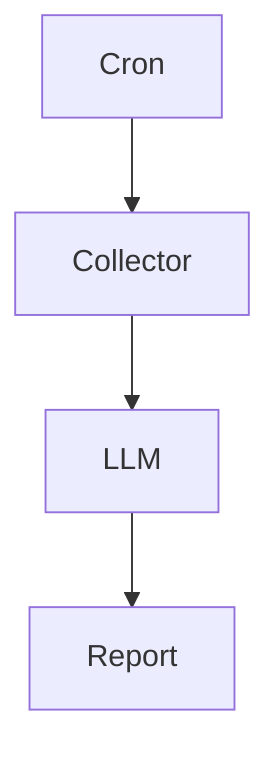
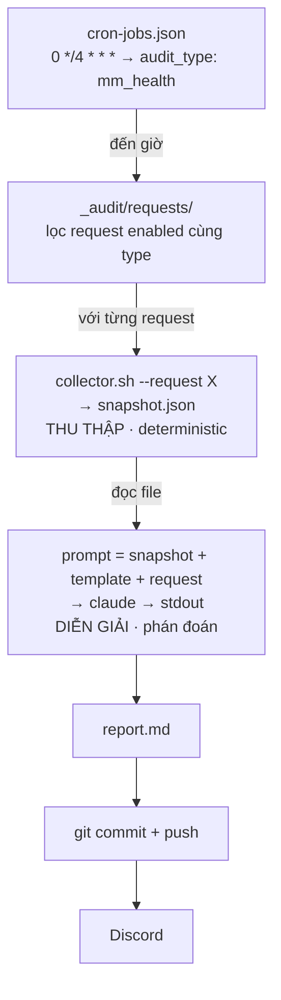

Hey hey, lại là hắn đây.

Có một điều khá thú vị khi làm việc với AI. Rất nhiều người muốn AI trở thành một nhân viên toàn năng. Họ giao cho nó quyền query database, đọc log, gọi API, SSH vào server, tự quyết định còn thiếu dữ liệu gì rồi cuối cùng mới đưa ra kết luận. Nghe rất thông minh, rất "agentic". Nhưng càng xây nhiều hệ thống, hắn càng thấy đây không phải một kiến trúc tốt. Không phải vì AI không đủ giỏi, mà vì chúng ta đang giao cho nó hai công việc hoàn toàn khác nhau. Một việc là đi tìm sự thật. Một việc là diễn giải sự thật.

Hai việc này nhìn qua tưởng giống nhau, nhưng bản chất lại gần như đối lập. Thu thập dữ liệu cần nhanh, chính xác, lần nào chạy cũng phải cho cùng một kết quả. Diễn giải dữ liệu thì ngược lại, nó cần khả năng suy luận, liên hệ và chấp nhận nhiều góc nhìn khác nhau. Nếu ép một agent làm cả hai cùng lúc, bạn sẽ rất khó biết một kết luận sai xuất phát từ reasoning của AI, hay đơn giản chỉ vì dữ liệu đầu vào đã sai ngay từ đầu.

Đó là lý do trong hệ thống audit market making của Djao Trading, hắn cố tình tách hai việc này thành hai pipeline hoàn toàn độc lập. Collector chỉ làm đúng một việc: chụp lại một bức ảnh của hệ thống tại một thời điểm. LLM cũng chỉ làm đúng một việc: đọc bức ảnh đó rồi đưa ra nhận định. Không hơn. Không kém.



## Kiến trúc tổng thể

Nếu nhìn kỹ hơn, toàn bộ một vòng audit trông như thế này.



Thoạt nhìn sơ đồ này khá bình thường. Nhưng điều quan trọng nhất lại không nằm ở Claude, GPT hay Gemini. Điều đáng giữ lại chính là ranh giới giữa các tầng. Cron chỉ trả lời câu hỏi "khi nào chạy". Request trả lời "muốn kiểm tra điều gì". Collector trả lời "hệ thống hiện đang như thế nào". LLM chỉ trả lời "vậy điều đó có ổn không". Mỗi tầng chỉ có một trách nhiệm duy nhất, và giao tiếp với nhau bằng một snapshot cố định.

## Collector chỉ được phép quan sát

Đây có lẽ là quyết định quan trọng nhất của cả hệ thống. Bản năng đầu tiên của rất nhiều người là đưa cho AI toàn quyền hành động. Muốn xem log thì tự xem. Muốn query database thì tự query. Thiếu dữ liệu thì tự gọi thêm API. Càng chủ động càng tốt. Nhưng hắn lại đi theo hướng ngược lại. Collector không được phép suy nghĩ. Nó chỉ được phép quan sát.

Lý do rất đơn giản. Khi AI tự đi lấy dữ liệu, bạn sẽ mất khả năng tái lập. Lần chạy lúc tám giờ sáng và lần chạy lúc mười hai giờ trưa có thể nhìn hệ thống theo hai cách khác nhau. Nếu báo cáo sai, bạn gần như không thể biết chính xác AI đã nhìn thấy điều gì. Mỗi lần reasoning cũng kéo theo thêm token, thêm thời gian và thêm chi phí, trong khi phần lấy dữ liệu vốn nên nhanh và rẻ. Quan trọng hơn cả, lỗi thu thập và lỗi diễn giải sẽ bị trộn lẫn với nhau. Có khi bạn mất cả buổi chỉ để phát hiện ra AI chẳng hiểu sai gì cả, chỉ là một câu SQL viết nhầm.

Vì vậy hắn kẻ một đường rất rõ giữa deterministic và non deterministic. Collector chỉ chụp lại sự thật rồi đóng gói thành một file JSON.

```bash
#!/usr/bin/env bash
set -euo pipefail

request="$2"; out="$4"
account=$(parse-audit-request.sh "$request" account)

jq -n \
  --arg account "$account" \
  --argjson positions "$(psql -tAc "SELECT ... WHERE account='$account'")" \
  --argjson quotes   "$(curl -s "$API/mm/quotes?acc=$account")" \
  --argjson funding  "$(curl -s "$API/funding/upcoming?acc=$account")" \
  '{collected_at: (now | todate), account: $account,
    positions: $positions, quotes: $quotes, funding: $funding}' \
  > "$out"
```

Scheduler chỉ việc gọi collector, chờ snapshot xuất hiện rồi dừng lại nếu không có kết quả.

```ts
this.exec(
  `bash "${script}" --request "${req.path}" --output "${snapshotPath}"`,
  typeDef.collectorTimeoutMs,
);

if (!existsSync(snapshotPath)) {
  this.logger.error(`Snapshot missing: ${snapshotPath}`);
  return;
}
```

Ở tầng này hoàn toàn không có AI. Chỉ có code, database và API. Chạy nhanh, rẻ và lần nào cũng cho cùng một kết quả.

## Audit request chính là prompt

Có một điều hắn rất thích trong kiến trúc này. Prompt không nằm trong code. Nó cũng không bị hardcode trong một chuỗi string dài hàng trăm dòng. Mỗi cuộc audit chỉ đơn giản là một file Markdown.

```markdown
---
id: mm-health-pavn
enabled: true
account: pavn-main
audit_type: mm_health
---

# Market Making Health

Hãy kiểm tra:

- Spread có bám target không?
- Inventory skew có vượt ngưỡng không?
- Funding sắp tới có tạo thêm rủi ro không?
```

Thoạt nhìn, đây chỉ giống như một file cấu hình bình thường. Phần frontmatter giúp scheduler biết audit này chạy khi nào, cho tài khoản nào và gửi báo cáo về đâu. Nhưng phần quan trọng nhất lại nằm bên dưới. Chính những dòng chữ mà con người viết ra mới là thứ AI sẽ đọc. Nói cách khác, audit request thực chất là một prompt được lưu trong git.

Điều này làm hắn thích hơn rất nhiều so với việc nhét prompt vào source code. Muốn AI quan tâm thêm funding thì chỉ cần sửa vài dòng Markdown. Muốn bỏ inventory hay thay đổi cách đánh giá spread cũng chỉ cần sửa đúng file đó. Không cần build lại ứng dụng, không cần deploy, cũng chẳng cần mở IDE. Prompt đã trở thành dữ liệu, và cũng giống như source code, nó có lịch sử thay đổi, có diff, có review và có thể quay về bất kỳ phiên bản nào.

Hắn nghĩ đây mới là điểm thú vị nhất của cả hệ thống. Rất nhiều người xem prompt chỉ là một đoạn string truyền vào LLM. Còn trong kiến trúc này, prompt được xem như một tài liệu chính thức của hệ thống. Collector chịu trách nhiệm tạo ra sự thật. Prompt quyết định AI phải quan tâm điều gì. Template quyết định AI phải trình bày như thế nào. Khi ba mảnh ghép đó được tách riêng, mỗi phần đều có thể tiến hóa độc lập mà không ảnh hưởng đến phần còn lại.

## Snapshot là nhân chứng

Nhiều người nghĩ snapshot chỉ là input cho AI. Với hắn thì không. Snapshot còn là nhân chứng.

Ba tuần sau nếu AI kết luận rằng inventory skew đã vượt ngưỡng bất thường, hắn không cần dựng lại database, không cần replay log, cũng không cần đoán xem AI đã nhìn thấy gì. Chỉ cần mở đúng snapshot của ngày hôm đó. AI chỉ được phép nhìn đúng những gì đã được chụp lại. Không hơn. Không kém.

Vì vậy snapshot được lưu cùng với báo cáo và được commit vào git.

```text
_audit/
├── cron-jobs.json
├── requests/
├── reports/
│   └── 2026/07/19/
│       ├── mm-health-pavn.snapshot.json
│       └── mm-health-pavn.md
```

Collector cam kết rằng đây là toàn bộ sự thật tại thời điểm T. LLM cam kết rằng mọi kết luận của nó đều dựa trên đúng bức ảnh đó. Snapshot trở thành hợp đồng giữa hai tầng của hệ thống.

## AI chỉ được phép đọc

Sau khi snapshot được tạo ra, AI mới bắt đầu xuất hiện. Nhưng ngay cả lúc này, hắn vẫn giới hạn quyền của nó rất chặt. AI không được query database. Không được gọi API. Không được SSH vào server. Nó chỉ nhận đúng ba thứ: snapshot, template và audit request.

```ts
const snapshot = readFileSync(snapshotPath, 'utf8');
const template = readFileSync(templatePath, 'utf8');

const prompt = typeDef.buildPrompt({
  req,
  snapshotJson: snapshot,
  template,
});

const result = await this.aiExecutor.execute(
  prompt,
  'claude',
  AUDIT_TIMEOUT_MS,
);
```

Template cũng quan trọng không kém snapshot. Không có template, hôm nay AI viết bảng, ngày mai viết văn xuôi, hôm sau lại tự nghĩ ra thêm vài mục mới. Có template, đầu ra đủ ổn định để những hệ thống khác tiếp tục xử lý. Báo cáo cuối cùng luôn chứa link ngược về request và snapshot đã sinh ra nó. Nếu thấy một kết luận đáng ngờ, chỉ cần mở snapshot là biết AI đã nhìn thấy điều gì.

## Phần còn lại chỉ là vận hành

Sau khi báo cáo được sinh ra, hệ thống commit vào git, push lên repository rồi gửi sang Discord. Nghe đơn giản nhưng vẫn còn một bài toán rất đời thường: chống chạy chồng. Nếu một vòng audit chạy lâu hơn chu kỳ của nó, rất dễ có hai process cùng ghi vào một chỗ.

```ts
if (this.running) return;
if (this.isLockHeldByOtherLiveProcess()) return;

this.running = true;
writeFileSync(LOCK_FILE, String(process.pid));

try {
  // run audit
} finally {
  this.running = false;
  execSync(`rm -f ${LOCK_FILE}`);
}
```

Điều thú vị hơn nằm ở stale lock. Nếu process chết giữa chừng, file lock vẫn còn đó và cả hệ thống sẽ đứng yên mãi mãi. Hắn dùng một mẹo rất nhỏ.

```ts
process.kill(pid, 0);
```

Dòng code này không giết process nào cả. Nó chỉ hỏi hệ điều hành xem PID đó còn sống hay không. Nếu còn thì nhường. Nếu đã chết thì dọn khóa rồi tiếp tục chạy. Chỉ một dòng nhưng đủ để biến một hệ thống dễ treo thành một hệ thống có khả năng tự phục hồi.

## Pattern này không dành riêng cho trading

Ví dụ trong bài viết là market making, nhưng thật ra bộ khung này có thể dùng ở rất nhiều nơi. Collector có thể query database, đọc log, gọi API, chạy `kubectl get`, hay `terraform plan`. Audit request có thể nói về SLA, chi phí cloud, chất lượng dữ liệu hay bảo mật. LLM có thể là Claude, GPT hay bất kỳ model nào khác. Discord cũng có thể đổi thành Slack, email hay PagerDuty.

Bất kỳ công việc nào mà mỗi ngày bạn đều phải mở dashboard lên, đọc dữ liệu rồi tự đưa ra nhận định, đều có thể đưa vào mô hình này.

## Kết

Sau khi hoàn thành hệ thống này, hắn nhận ra AI không cần trở thành một operating system. Nó cũng không cần thay con người đi tìm sự thật.

AI giỏi nhất ở một việc khác. Đó là tìm ra ý nghĩa của những sự thật đã có. Đi tìm sự thật là việc của collector, database và những đoạn code chạy đều đặn mỗi ngày. Đi tìm ý nghĩa mới là nơi AI thật sự phát huy giá trị.

Khi tách hai việc đó ra, mọi thứ bỗng trở nên đơn giản hơn rất nhiều. Collector hôm nay viết bằng Bash, ngày mai có thể đổi sang Go hay Rust. Claude vài năm nữa có thể được thay bằng một model hoàn toàn mới. Nhưng snapshot vẫn ở đó.

Nó là lời cam kết giữa hai tầng của hệ thống. Một bên nói: "Đây là toàn bộ sự thật mà tôi nhìn thấy." Bên còn lại trả lời: "Vậy để tôi kể cho bạn nghe, bức ảnh này đang nói lên điều gì."


*❤️ cowriter aethery*
