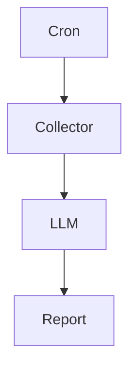
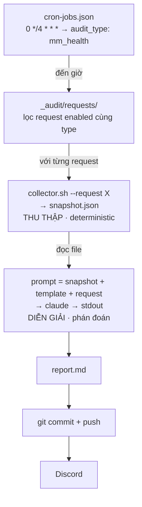

Hey, lại là hắn đây.

Một trong những sai lầm phổ biến nhất khi build AI agent là giao cho nó làm tất cả: query database, đọc log, gọi API, tự quyết định cần thêm dữ liệu gì, rồi cuối cùng mới kết luận. Nghe rất "agentic". Nhưng càng làm hắn càng thấy đây không phải một architecture tốt. Không phải vì LLM không đủ thông minh, mà vì nó đang làm hai công việc hoàn toàn khác nhau: thu thập dữ liệu và diễn giải dữ liệu.

Hai việc này có yêu cầu gần như trái ngược nhau. Thu thập cần deterministic, reproducible, nhanh, rẻ. Diễn giải cần reasoning, flexibility, contextual understanding. Nếu trộn hai việc này vào cùng một agent, bạn sẽ mất gần như mọi lợi ích của cả hai.

Nên trong hệ thống audit market-making của Djao Trading, hắn cố tình tách chúng thành hai pipeline hoàn toàn độc lập. Collector chỉ chịu trách nhiệm tạo ra một **snapshot**. LLM chỉ chịu trách nhiệm đọc snapshot đó. Không hơn. Không kém. Kiến trúc trông như thế này:




## Kiến trúc chi tiết

Zoom vào, cùng một vòng lặp trông như thế này:



Bốn tầng, bốn trách nhiệm tách bạch:

| Tầng | Câu hỏi nó trả lời | Bản chất |
|------|--------------------|----------|
| **Cron** | *Khi nào chạy?* | lịch, sống trong file config |
| **Request `.md`** | *Soi cái gì?* | khai báo (declarative), không phải code |
| **Collector `.sh`** | *Hiện trạng ra sao?* | deterministic, không có AI |
| **LLM** | *Vậy có ổn không, vì sao?* | phán đoán, không tự đi lấy data |

Insight nằm ở chỗ **tách**, không phải ở chỗ gọi được AI.

## Design Decision #1 — Collector phải hoàn toàn deterministic

Bản năng đầu tiên của ai cũng là đưa cho AI cái quyền chạy lệnh, để nó tự đi query DB, tự gọi API, tự đọc log, rồi tự kết luận. Một agent làm tất, nghe gọn, nhưng hỏng ở ba chỗ:

- **Không tái lập được.** Lần chạy 8 giờ sáng và lần chạy 12 giờ trưa hỏi DB theo hai cách hơi khác nhau, và bạn không bao giờ biết chính xác nó đã nhìn thấy gì. Khi báo cáo sai, bạn không có tang chứng
- **Đắt và chậm.** Mỗi vòng suy luận "để tôi query thử cái này… à chưa đủ, query thêm cái kia" là token và là thời gian. Phần lấy data vốn *nên* rẻ và cố định
- **Trộn hai loại lỗi.** Lỗi thu thập (query sai bảng) và lỗi diễn giải (đọc sai ý nghĩa) lẫn vào nhau, gỡ mãi không ra

Quyết định: kẻ một đường thẳng giữa **deterministic** và **non-deterministic**.

> Shell script lo phần *sự thật*: chụp một tấm ảnh cố định, in ra JSON, lưu thành file. LLM lo phần *ý nghĩa*: đọc đúng tấm ảnh đó và phán.

Với mỗi request, scheduler gọi đúng một shell script và bảo nó đổ kết quả ra file. Tuyệt đối không có AI ở tầng này, chỉ query, gom, in JSON:

```bash
#!/usr/bin/env bash
set -euo pipefail
# collect-snapshot.sh --request <file.md> --output <snapshot.json>
# Không suy luận. Chỉ lấy sự thật và đóng gói.

request="$2"; out="$4"
account=$(parse-audit-request.sh "$request" account)

jq -n \
  --arg account "$account" \
  --argjson positions "$(psql -tAc "SELECT ... WHERE account='$account'")" \
  --argjson quotes   "$(curl -s "$API/mm/quotes?acc=$account")" \
  --argjson funding  "$(curl -s "$API/funding/upcoming?acc=$account")" \
  '{collected_at: (now | todate), account: $account,
    positions: $positions, quotes: $quotes, funding: $funding}' \
  > "$out"
```

Bên phía scheduler, việc gọi nó có timeout riêng, và nếu file không hiện ra thì dừng luôn, không có ảnh thì không có gì để đọc:

```ts
this.exec(
  `bash "${script}" --request "${req.path}" --output "${snapshotPath}"`,
  typeDef.collectorTimeoutMs,
);
if (!existsSync(snapshotPath)) {
  this.logger.error(`Snapshot missing: ${snapshotPath}`);
  return;
}
```

Vì phần thu thập là code thuần, nó chạy trong một giây, không tốn một token nào.

## Design Decision #2 — Audit request là data, không phải code

Mỗi thứ cần kiểm là **một file markdown**, không phải một nhánh `if` trong code. Đây là declarative configuration: cùng họ với Kubernetes manifest, GitHub Actions workflow, Terraform module. Request chỉ mô tả audit gì, account nào, gửi đâu, hỏi gì. Scheduler không cần biết nội dung chi tiết.

```markdown
---
id: mm-health-pavn
enabled: true
account: pavn-main
audit_type: mm_health
server: pavn
discord_channel_id: "123456789012345678"
---

# Sức khỏe market-making — pavn

Soi 4 tiếng một lần. Cần trả lời:

- Spread có bám target không? Lệch bao nhiêu bps, ở symbol nào?
- Inventory skew có vượt ngưỡng ở đâu không?
- Có symbol nào ngừng quote quá 5 phút?
- Funding sắp tới có phối hợp với vị thế thành rủi ro không?
```

Phần frontmatter là *máy đọc* (bật/tắt, tài khoản nào, loại nào, gửi kênh Discord nào). Phần thân là *người viết cho AI đọc*, chính là những câu hỏi bạn muốn được trả lời, viết bằng tiếng người. Cái `enabled: true` nhỏ xíu đó là một cái van: muốn tạm ngắt một audit thì đổi thành `false`, muốn thêm mối quan tâm mới thì thả một file `.md` nữa vào thư mục. Scheduler chỉ nhặt những request đang bật và đúng `audit_type` của cron vừa nổ:

```ts
const requests = this.listEnabledRequests()
  .filter((req) => (req.audit_type ?? 'v4_health') === auditType);
```

Người vận hành thêm/bớt thứ cần soi mà không bao giờ phải mở IDE. **Thứ cần kiểm là dữ liệu, không phải mã.**

## Design Decision #3 — Snapshot phải được version

Snapshot không chỉ là input cho LLM. Nó còn là **evidence**. Nếu ba tuần sau AI kết luận "inventory skew bất thường", hắn mở đúng cái snapshot của hôm đó ra kiểm chứng, không cần dựng lại quá khứ. Đổi model, chạy lại prompt trên cùng snapshot, so sánh output. Đó mới là reproducibility.

Snapshot được ghi vào một đường dẫn có ngày tháng (`reports/2026/07/19/…snapshot.json`) và commit vào git. Cấu trúc thư mục gọn gàng để cả người lẫn máy đều lần ra:

```text
_audit/
├── cron-jobs.json                  # lịch: cron expr → audit_type
├── requests/
│   ├── mm-health-pavn.md           # 1 file = 1 mối quan tâm (enabled)
│   └── funding-scan.md
└── reports/
    ├── _templates/                 # khung output cho LLM
    └── 2026/07/19/
        ├── mm-health-pavn.snapshot.json   # tang chứng (git-tracked)
        └── mm-health-pavn.md              # báo cáo LLM viết

.claude/skills/ops/mm-*-audit/
├── collect-snapshot.sh             # thu thập → JSON
├── parse-audit-request.sh          # đọc frontmatter request
└── post-mm-audit-discord.sh        # gửi Discord
```

Snapshot là hợp đồng giữa collector và LLM: collector cam kết "đây là sự thật tại thời điểm T", LLM cam kết "tôi chỉ suy luận trên tấm ảnh này".

## Design Decision #4 — LLM chỉ đọc

LLM không được phép query database, gọi API, ssh hay đọc log. Nó chỉ đọc đúng một snapshot, cộng thêm template và request. Nghe hạn chế, nhưng đổi lại bạn có deterministic input, predictable cost, reproducible output, và dễ debug hơn nhiều. Quan trọng nhất: bạn có thể thay Claude bằng GPT, hay GPT bằng Gemini, mà collector không cần đổi một dòng code.

AI nhận đúng ba thứ: tấm snapshot vừa chụp, một cái **template** quy định hình dạng báo cáo, và bản request (những câu hỏi tiếng người). Từ ba thứ đó dựng một prompt, gọi model, lấy `stdout`:

```ts
const snapshot = readFileSync(snapshotPath, 'utf8');
const template = readFileSync(templatePath, 'utf8');   // khung output

const prompt = typeDef.buildPrompt({
  req, snapshotJson: snapshot, template, repoDir: this.repoDir,
});

const result = await this.aiExecutor.execute(
  prompt, 'claude', AUDIT_TIMEOUT_MS, { truncateOutput: false },
);
if (result.exitCode !== 0 || !result.stdout.trim()) {
  this.logger.error(`Claude audit failed (exit=${result.exitCode})`);
  return;
}
```

Cái template quan trọng hơn vẻ ngoài của nó. Không có khung, mỗi lần LLM lại viết một kiểu: hôm nay là bảng, mai là văn xuôi, mốt lại bịa thêm một mục `# MM Audit` trùng với header hắn tự gắn. Có template, đầu ra ổn định đủ để máy khác đọc tiếp. (Hắn còn phải cắt cái tiêu đề LLM hay tự nhân đôi, `stripDuplicateReportHeader`, nhưng đó là chuyện nhỏ.) Đầu ra được bọc thêm metadata rồi ghi thành báo cáo, có link ngược về đúng cái request và snapshot đã sinh ra nó:

```ts
const metadata =
  `# MM Audit — ${collectedAt}\n\n` +
  `**Request:** [${requestFilename}](${relRequest})\n` +
  `**Snapshot:** [JSON](${relSnapshot})\n` +
  `**Account:** ${req.account} · **Request ID:** \`${req.id}\`\n\n`;

writeFileSync(reportPath, header + metadata + body + '\n', 'utf8');
```

Mỗi báo cáo tự mang theo nguồn gốc của nó. Đọc kết luận thấy nghi ngờ? Bấm vào link snapshot, xem tận mắt AI đã nhìn thấy gì.

## Vận hành: git, Discord, và chống chạy chồng

Xong bốn design decision, còn phần đuôi vận hành: báo cáo được commit + push (để có lịch sử, diff được theo ngày), rồi đẩy vào Discord cho người nhận. Một mảnh nhỏ mà ai làm cron cũng sớm muộn phải học là **chống chạy chồng**: hai cron nổ gần nhau, hoặc một mẻ chạy lâu hơn chu kỳ, và bỗng dưng có hai lần audit cùng ghi đè lên nhau. Hắn khóa hai lớp, một cờ trong process, một file PID trên đĩa:

```ts
if (this.running) return;                        // cùng process này
if (this.isLockHeldByOtherLiveProcess()) return; // process khác còn sống

this.running = true;
writeFileSync(LOCK_FILE, String(process.pid), 'utf8');
try {
  /* ... chạy mẻ audit ... */
} finally {
  this.running = false;
  execSync(`rm -f ${LOCK_FILE}`);
}
```

Điểm tinh tế là *lock chết* (stale lock): process cầm khóa lăn ra chết mà chưa kịp dọn, khóa nằm lại vĩnh viễn, audit tắc luôn. Mẹo là hỏi hệ điều hành xem cái PID trong khóa còn sống không:

```ts
process.kill(pid, 0);   // không giết ai — chỉ ném lỗi nếu pid đã chết
                        // ném → chủ khóa đã chết → xoá khóa, đi tiếp
```

`kill(pid, 0)` không thực sự giết gì; nó chỉ kiểm tra "process này còn đó không". Còn sống thì nhường; đã chết thì dọn cái khóa mồ côi và chạy tiếp. Một dòng, nhưng là ranh giới giữa một hệ tự phục hồi và một hệ treo cứng lúc 3 giờ sáng.

## Vài cái hố hắn đã giẫm

- **Timeout ở mọi tầng.** Collector có timeout, lời gọi AI có timeout, mỗi lệnh git có timeout. Thiếu một cái, cả vòng lặp treo và các chu kỳ sau dồn ứ
- **Đừng để AI đi lấy data.** Nhắc lại vì nó quan trọng: khoảnh khắc bạn cho AI tự query, bạn mất tính tái lập và ví tiền bắt đầu rỉ. Snapshot trước, phán sau
- **Template không phải trang trí.** Nó là hợp đồng về hình dạng đầu ra. Không có nó, không có gì downstream đọc được báo cáo một cách đáng tin
- **Báo cáo phải tự mang nguồn gốc.** Link ngược về request + snapshot biến một lời khẳng định mơ hồ thành một thứ kiểm chứng được
- **Enabled là một cái van, không phải xoá file.** Tắt một audit bằng cách sửa cờ, đừng xoá, bạn sẽ muốn bật lại, và git giữ lịch sử giúp bạn

## Pattern có thể áp dụng rộng

Ví dụ trên là market-making, nhưng không có gì trong bộ xương này dính riêng vào trading. Nó là một architectural pattern cho bất kỳ hệ thống nào cần AI audit:

| Trong ví dụ | Đổi thành của bạn |
|-------------|-------------------|
| `cron-jobs.json` | cron, systemd timer, GitHub Actions, hay hàng đợi bất kỳ |
| `collect-snapshot.sh` | query DB · gọi API · đọc log · `kubectl get` · `terraform plan` |
| `request.md` | thứ cần soi: SLA, chi phí cloud, lỗ hổng bảo mật, chất lượng dữ liệu |
| `claude` | model bất kỳ, với prompt + template của bạn |
| Discord | Slack · email · PagerDuty · một issue tự mở |

Bất cứ hệ thống nào mà bạn thấy mình phải *ngồi đọc rồi phán mỗi ngày*, chi phí AWS trườn lên, migration dữ liệu có toàn vẹn không, một dịch vụ có bám SLA không, đều vừa cái khuôn này.

## Kết luận

Sau khi tách collector khỏi reasoning, hắn nhận ra AI không cần trở thành một operating system, nó chỉ cần trở thành một compiler: collector compile thế giới thực thành snapshot, LLM compile snapshot thành insight. Hai tầng độc lập, có thể thay thế, test riêng và scale riêng.

Điều hắn mang đi không phải tên file hay lịch cron, mà là ranh giới: thu thập deterministic, suy luận tách riêng, snapshot làm hợp đồng giữa hai phía. Phần còn lại — model nào, kênh Discord hay Slack, script viết bằng gì — có thể đổi từng mảnh mà không đụng vào insight đó.

*❤️ cowriter aethery*
