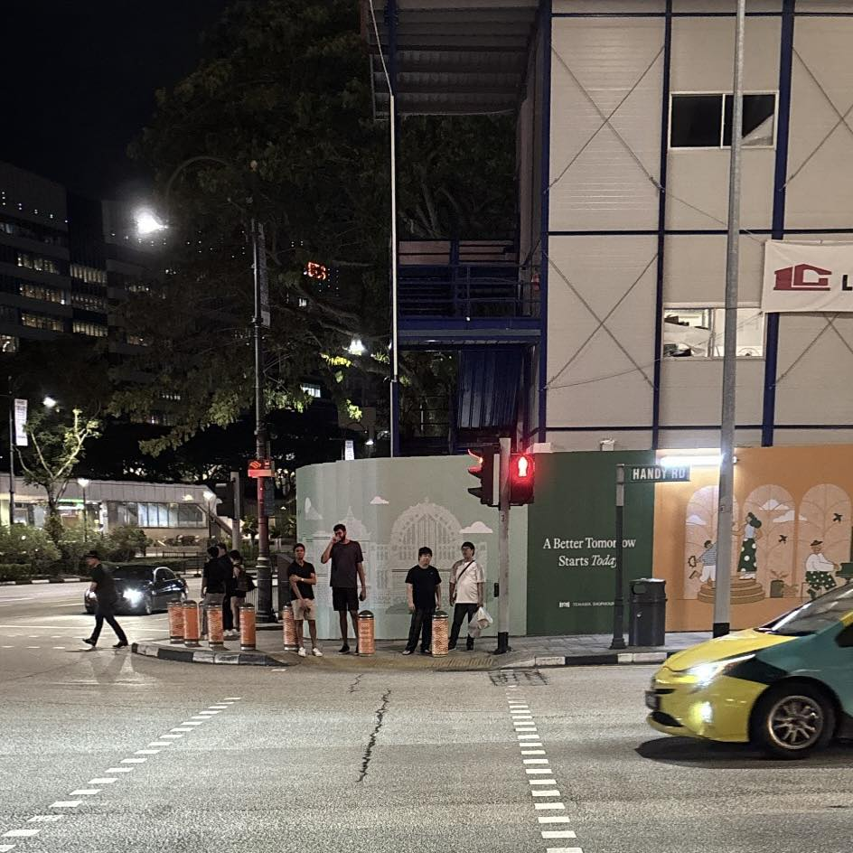

Hey, it's him again, and he plans to stay in Singapore until early June. For many, Singapore has a lot of cool things: but for him, the sidewalk is Singapore's greatest achievement

In Singapore, only three things grow from the ground: housing, trees, and sidewalks. Houses are beautiful, trees are abundant, and sidewalks are spacious. Most buildings leave an open space in front as public pathways. This sacrifice inadvertently provides Singaporeans with a massive public resource

He noticed that almost every sidewalk here connects to the main street with very low curbs: low enough for bicycles, strollers, or wheelchairs to slide over smoothly. If you use a wheelchair, you can go almost anywhere with virtually no assistance. Here, infrastructure is designed for everyone. He loves cycling here. Bicycles are allowed on sidewalks, and you can practically use a bike to travel the entire country. And bicycles are everywhere

To him, sidewalk development is the pinnacle of national vision and solidarity. Because to build a modern subway system, you only need money and a reputable contractor. But to develop an extensive sidewalk network, you need sacrifice and consensus from all classes of society. Without a good education system and a fair legal framework, it is hard to reach such broad consensus. Hopefully, Vietnam will learn these cool things soon

*❤️ cowriter aethery*
