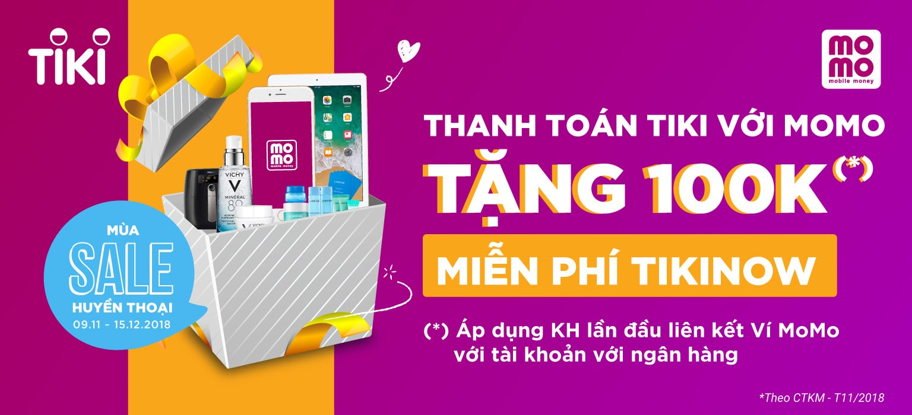

Hey, it's him again. Sometime between 2017 and 2019, he used to only buy things on Tiki. Every time he heard of Shopee, he felt unsafe. But now the situation has completely changed. He hasn't bought anything on Tiki for a long time, and he feels extremely reassured when shopping on Shopee.

Even for companies without a store on Shopee, he tends to think they are not very reputable. This article consists of his subjective observations and thoughts to answer a personal question: Why has Tiki fallen so far behind?

This is his view of Tiki since 2020, [Software: The battle between parallel forces](https://xaolonist.com/en/blog/phan-mem-luong-cuc/).

## What makes him really satisfied with Shopee

Shopee is an e-commerce platform, but their revenue comes from connecting sellers and buyers through Payment and Shipping services.

This is the vision that runs through Shopee's actions. Since coming to Vietnam, they have only done two major things: buying AirPay and turning it into ShopeePay, and then launching Shopee Express, SPX.

Coincidentally, these are also the two main reasons why he uses Shopee:

**Protecting consumer rights**

- Payment and refund are easy and quick, making users feel very safe when shopping on Shopee. They may have used low prices to attract sellers and buyers, but their every step shows a clear vision in developing e-commerce products

**Super fast delivery**

- From the beginning, Shopee partnered with GHTK: the smooth cooperation between the two companies made it seem like they were two products of the same company
- This is an important move, because shipping is one of the things that brings in large revenue for e-commerce platforms. Just like in a revolution, whoever controls the speaker will control the people: in e-commerce, shipping is a prerequisite

## The reasons why Tiki has become backward

The main reason why Tiki has become backward is that they don't have a clear vision, standing amidst a pile of money but not knowing who they are and what to do. They don't focus on their main product. Tiki creates too many enemies, but doesn't have a big enough friend by their side.

- Developing Astra: this is a reward module with Crypto colors developed by Tiki, and he doesn't understand how Astra became the main menu on the mobile app, showing a clear lack of focus on product development
- Launching Ngon: fresh food, which is a very difficult and expensive task, even Coop only stopped at an acceptable level in this area. High cost but difficult to expand, margin is not high, and it is difficult to compete with existing local products
- Acquiring Ticketbox: based on his observation, this may be a bad deal where the company will not gain much benefit, though some supporters of this deal will receive certain benefits, perhaps as an exit strategy for high-level members
- Talking a lot about AI, ChatGPT, and other things unrelated to the real needs of users. He can say that the product developers at Tiki are far from reality and customers, developing products based on the perceptions of a few people. A product that talks about AI, blockchain, and still has a long Category Menu on the left like that. When users log in, they should know what users need before anything else

## What Tiki needs to do

First and foremost, the most important thing is to define who they are. Similar to Shopee, focus on becoming a Payment and Shipping service provider. This is also a prerequisite for Tiki to be able to boldly eliminate unnecessary products as mentioned above, and aggressively partner and acquire potential partners.

There are two main things that Tiki can do to quickly increase revenue and regain their position. If Tiki doesn't do it soon, they will run out of money. This is the time for Tiki to humble themselves, make friends, reduce enemies, and wait for the opportunity to attack after regaining the upper hand.

.jpg)

**Partner with GHTK**

- Maybe Sea is no longer the main shareholder of GHTK, or has completely divested. This leads to Shopee developing its own shipping system, which directly affects the future of GHTK. Something that GHTK also needs to be wary of: don't wait until they are left behind to realize it's too late. With quick and accurate moves to an incredible degree, Shopee is a war machine that makes any opponent need to be careful
- If they dominate the e-commerce market in the near future, their next opponent will not be Tiki or Lazada anymore: it will be MoMo or ZaloPay. A terrifying battle that those who are not prepared will fail quickly and cannot resist, knock-out

**Become a strategic partner with MoMo or ZaloPay**

- Maybe MoMo or ZaloPay are giants in the field of e-wallets, but the e-wallet itself has a lot of gaps that can be filled, one of which is support for e-commerce platforms, with the goal of doing the entire purchase process right in the e-wallet itself
- As mentioned above, Shopee's ambition will never stop at e-commerce, which is also the time when e-wallets prepare themselves a backup plan before the unexpected landing from Shopee

Knowing that it will take a long time, and a lot of work, if Tiki wants to regain its position. Hopefully Tiki can do it.

By the way, if Tiki has a light job with a high salary, please message him. Since he has been unemployed lately, he has plenty of time to ramble on like this.

*❤️ cowriter aethery*
