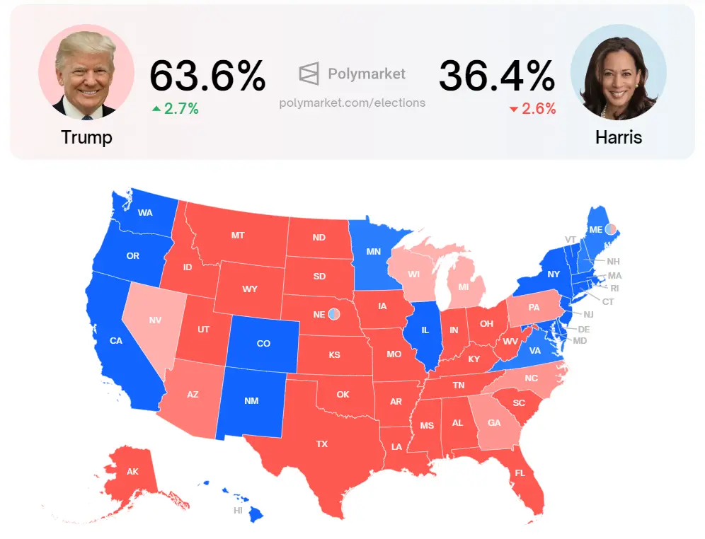
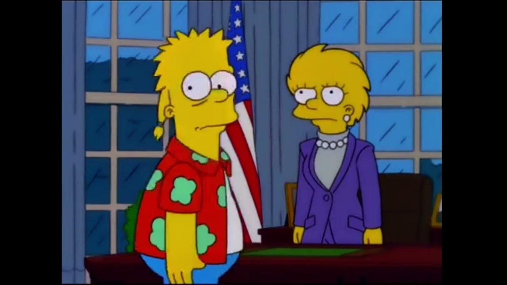

Hey, cho dù bạn là ai, là gái hay trai, sống ở đâu, quan điểm triết học, xu hướng chính trị là gì. Dù muốn dù không, bạn cũng không thể thoát khỏi quyền lực đen tối của đồng Đô La. Đồng Đô La đã len lõi vào tất cả các ngóc ngách của cuộc sống mỗi người.

Với sự liên kết thiếu chặt chẽ của các cường quốc trên thế giới, cộng với sự phát triển của Crypto và AI trong những năm vừa qua. Đồng Đô La đang đối mặt với một trận chiến cuối cùng. Trận chiến sẽ đưa lich sử nhân loại bước sang một trang mới, thú vị, hoành tráng hơn rất nhiều. Trận chiến sẽ đưa nhân loại vào Tân Thế Giới.

### Lịch sử của đồng Đô La

Đồng Đô La xuất hiện vào năm 1913, được bảo chứng bởi vàng. Cho tới năm 1971, đồng Đô La thoát khỏi bản vị vàng và được hậu thuẫn hoàn toàn bởi nợ công Mỹ. Nếu quan sát kỹ, bạn sẽ nhận ra rằng đồng Đô La rất khác so với hầu hết các loại tiền pháp định, Fiat, có mặt trên thế giới hiện tại. Trong khi hầu hết các loại Fiat được phát hành và quản lý bởi chính phủ, thì đồng Đô La lại được quản lý bởi FED, một công ty tư nhân Mỹ.

Có thể nói nôm na rằng, ở hầu hết các quốc gia, từ lục địa già cỗi ở Châu Âu, tới những quốc gia mới được thành lập sau chiến tranh thế giới thứ 2. Quốc gia có trước, ngân hàng có sau. Tuy nhiên ở Mỹ thì lại khác, ngân hàng có trước, và quốc gia có sau. Và ngân hàng và các thế lực ngầm đứng ở sau, đang điều khiển nước Mỹ, và thông qua Mỹ để đặt sự quản lý lên các quốc gia khác, những con người khác.

Đồng Bảng Anh đã làm mưa làm gió trên toàn thế giới, trước khi được thay thế bởi đồng Đô La. Và cho tới hiện tại, đồng đô la cũng đã tồn tại và phát triển được hơn 100 năm rồi. Đã đến lúc thể giới chào đón 1 loại tiền tệ chung mới?

### Make America Great Again

Vài năm trước, trong thời kỳ Trump làm tổng thống, từ đầu năm 2017. Chiến dịch Vĩ Đại của Trump, Make American Great Again. Hành động rõ ràng nhất của chiến dịch đó là đem phần lớn việc làm từ Trung Quốc về Mỹ. Hành động này đã khiến Trung Quốc rơi vào một cuộc khủng hoảng lớn chưa từng có trong lịch sử. Làm nền kinh tế Trung Quốc lao dốc, và vừa mới đây, ở đầu quý 4/2023 thị trường chứng khoán Trung Quốc đã chạm đáy.

Tuy vậy, hành động này đã gián tiếp làm suy yếu sức mạnh của đồng Đô La. Về lâu dài, việc có ít sự hiện diện của các công ty Mỹ ở Trung Quốc lại là một cơ hội lớn cho Trung Quốc để có thể thoát khỏi sự ảnh hưởng của đồng Đô La. Trung Quốc đã mở rộng chiến dịch Vành Đai và Con Đường. Cũng như phát triển các liên minh mới, BRICS, nhằm giảm sự lệ thuộc vào Mỹ và đồng Đô La. 

Trump đã vô tình làm cho sức mạnh của đồng Đô La vị đứt gãy, và thả một con quái thú ra ngoài biển khơi.

### Trận chiến cuối cùng

Trump, chưa bao giờ trong lịch sử nước Mỹ, có một ứng viên tổng thống dám công khai chống lại sức mạnh của đồng Đôla. Vị tổng thống gần đây nhất dám công khai chống lại đồng đô la đó chính là John F. Kennedy. Ngay sau đó ông đã bị ám sát vào năm 1963. Sau đó đã tạo ra mối thù truyền kiếp giữa nhà John F. Kennedy với giới quyền lực ngầm của chính trường Mỹ.

Có một điều thú vị là, ở nhiệm kỳ trước, 2017, Trump luôn hô hào bảo vệ đồng Đô La. Nhưng lần này lại khác. Phải chăng, quyền lực của những ông chủ đứng sau đồng Đôla đã bị lung lay? Nếu Trump thắng cử, có khả năng giới quyền lực ngầm đã từ bỏ quyền kiểm soát của họ trên đồng đôla. Hoặc sức mạnh của họ đã không còn đủ lớn để chi phối tới chính trường mỹ. Hoặc họ sẽ kiểm soát thế giới theo một cách khác, thông qua Crypto và AI.

Chưa trở thành tổng thống mà Trump đã chứng kiến ít nhất 2 lần bị ám sát. Nếu Trump vẫn còn sống sau 4 năm nhiệm kỳ, thì đây có lẽ sẽ là một dấu chấm hết cho sự bá chủ của đồng đô la trong vòng hơn 100 năm qua. Nơi mà những thế lực cũ nhất ở trên trái đất, bắt từ bỏ sự kiểm soát của họ đối với thế giới hiện tại. Nơi mà sức mạnh của đồng đô la, cán cân quyền lực mềm, duy trì sự ổn định của thế giới trong vòng bao nhiêu năm qua, lần đầu tiên được thả lỏng. 

Thế giới sẽ bước sang một thời đại mới, Thời Đại Hỗn Mang, Tân Thế Giới.

### Thời Đại Hỗn Mang, Tân Thế Giới

Không có đồng Đôla thống trị, một lỗ hổng quyền lực cực lớn sẽ xuất hiện trên Vũ Đài Lịch Sử. Các thế lực cách mạng mới sẽ hình thành. Các liên minh công lý mới sẽ được phát triển cực kỳ nhanh chóng. 

Kẻ nào thức thời trong giai đoạn này chính là đội ngũ sẽ lãnh đạo Tân Thế Giới trong nhiều thập kỷ tiếp theo. 2030, có thể sẽ là một cột mốc đánh dấu sự chuyển mình của lịch sử nhân loại, khi mà:

- Thế giới không còn phụ thuộc vào dầu mỏ
- Năng lượng là tiền, kẻ nào kiểm soát năng lượng, kẻ đó thống trị thế giới
- Các liên minh công lý mới xuất hiện
- Trong đó, Bitcoin, Crypto, AI là một phần tất yếu

### Cuộc bầu cử mỹ 2024, Trump vs. Harris

Cuộc bầu cử tổng thống Mỹ đang chuẩn bị đến hồi kết, và ván bài sẽ lật ngửa vào thứ 3 đầu tiên của tháng 11. Ngày 5/11/2024, chúng ta sẽ biết ai là người sẽ lãnh đạo nước Mỹ trong nhiệm kỳ 4 năm tiếp theo. Theo thống kê trên Polymarket, Trump đang dẫn trước Harris với tỉ số ấn tượng.

Mình không cược cho Harris sẽ thắng cuộc bầu cử này. Vì chung quy lại, nước Mỹ vẫn là một nước phân biệt chủng tộc cực kỳ rõ rệt. Sẽ rất khó để người dân mỹ có thể chấp nhận 1 phụ nữ da màu lãnh đạo họ. Tuy Obama đã từng là lãnh đạo da màu đầu tiên làm tổng thống. Tuy nhiên ở thời điểm đó, nền kinh tế Mỹ đang kiệt quệ sau bong bóng bất động sản năm 2007, và thị trường chứng khoán chạm đáy vào năm 2008. Cùng năm đó Obama làm tổng thống.

Lần này lại khác, thị trường chứng khoán Mỹ đang ở thời kỳ ATH, cực kỳ đỉnh cao. Và nền kinh tế Mỹ chưa chắc đã lâm vào suy thoái vào cuối năm 2024 hay nửa đầu năm 2025. Nên việc người dân Mỹ chấp nhận 1 phụ nữ da màu làm tổng thống trở nên khó khăn hơn bao giờ hết.

Tuy nhiên, mình sẽ cảm thấy rất ngạc nhiên nếu Trump có thể thắng trong cuộc bầu cử này. Chỉ vì 1 lý do duy nhất. Trump dám chống lại đồng ĐôLa, thậm chí trong lúc ổng chưa là tổng thống.

### Và lời Tiên tri từ Gia Đình Simpson

Trong một tập phim phát sóng vào năm 2000, có tựa đề "Bart to the Future," The Simpsons gây sốc khi tiên đoán Donald Trump trở thành tổng thống Mỹ. Trong tập này, Lisa Simpson trở thành tổng thống và nói rằng chính quyền của cô phải đối mặt với một cuộc khủng hoảng tài chính nghiêm trọng do chính quyền Trump trước đó để lại.

Đây có thể không phải nói về năm 2018. Mà có thể đang nói về năm 2024. Trump lên làm tống thống, khuấy đảo thế giới trong 4 năm. Sau đó để thế giới hỗn mang lại cho Harris. Lúc này cô chỉ cần thêm 2 năm để sụp đổ nó, 2030. Một trang mới trong lịch sử nhân loại bắt đầu.

🍍🍍🍍

Nếu có thể, hẹn gặp các bạn ở Tân Thế Giới!
