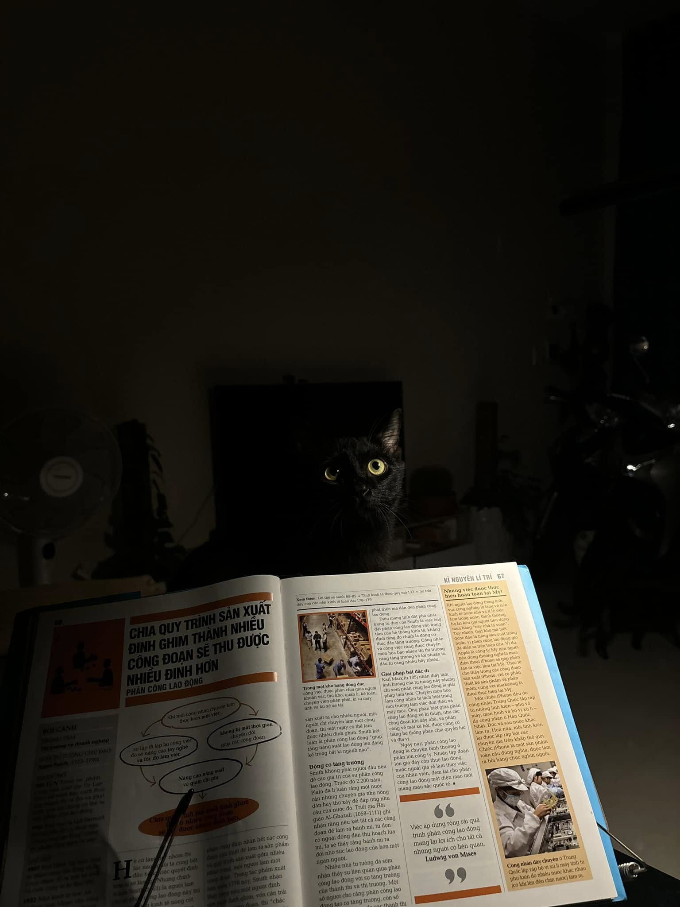

Hey, lại là hắn, việc của hắn là nói xàm, bạn tin những gì hắn nói, kệ bạn.

Sau khi bật sếp, và nói chuyện kỹ thuật chuyên sâu với đồng nghiệp thì hắn đã trở thành một blogger toàn thời gian, thay vì là lập trình viên full-time như trước đây. Hắn tự cho rằng đây là bước ngoặc lớn của cuộc đời. Khi mà thất nghiệp giờ đây là một lựa chọn mà hắn có thể chọn lựa.

Hắn sống đủ lâu để hiểu rằng, sẽ rất hời nếu phải đổi bất kỳ thứ gì hắn có để lấy những giấc ngủ sâu không mộng mị.

Hồi xưa, Vũ Trọng Phụng đã từng mong ước được đổi văn của anh để lấy thịt bò, nhưng con người mà, họ thích những cái có thể cầm nắm được, đặc biệt là những cái có thể cho vào bụng, hơn là các thể loại văn vẻ phù phiếm, thứ chỉ dùng để thoả mãn tâm hồm của những kẻ mộng mơ đầy dục vọng.

Dẫu biết rằng, viết lách là một cái nghề bạc bẽo. Nhưng nếu không đổi được thịt bò, thì chí ít có thể đổi văn của hắn lấy ít Catsrang được hem. Hắn có nhiều mèo. Meow meow. 🐱😹😻😿😸😽

