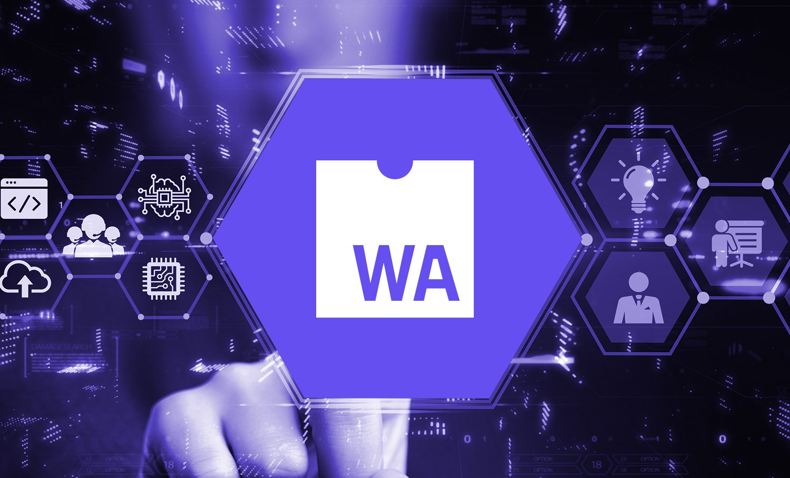

Hey, it's him again. After witnessing the boom of v0.dev, he knows: the golden era of the modern web is gradually coming to an end. The chaotic war among JavaScript kings (where React, Vue, and Svelte took turns raising their banners to claim territory) will eventually come to a close. Not because a winner has emerged, but simply because that war has fulfilled its role. An era ends to prepare for an even larger, more fierce battle: WebAssembly.

This is no longer a local conflict between JS tribes, but a full-scale war across the entire realm between low-level forces: Rust, Go, C++, and C#. Languages that once existed only behind the scenes in core systems are now stepping into the light, armed with the ultimate weapon of Wasm: as if ancient gods had returned to claim the throne in the fertile land where JS is the King of Kings.

## The Impotence of Current Frameworks

Current frameworks (from React to Svelte), though they have changed their syntax, developer experience, and added new concepts like Server Components, Signals, or Hydration, still essentially revolve around the JS + DOM + Runtime loop. Even Web3, despite its mission to redefine the internet, has not broken out of that frame.

Wasm emerges as an inevitable path: not to replace everything, but to open a different direction where performance and security are prioritized, and where the browser is no longer a limit but a launchpad.

Perhaps WebAssembly is exactly what will help Web3 truly mature: when the trust and security of end-users are guaranteed from the very first lines of code.

## Wasm: The Beginning of a New Era

Wasm completely changes how we approach web development. It is no longer just JS running in the browser's "unprofessional" environment, but modules compiled from Rust, C++, C#, or Go: powerful, isolated, and secure.

It opens new doors in security, performance, low-level interoperability, and above all, the convergence between web and desktop, frontend and backend. An era where the concept of "full-stack" will no longer be a privilege of the few, but an inevitable trend for every product development team.

## The Pioneers

A few names have quietly taken the lead:
- Figma: leveraging Wasm's performance to handle real-time vector graphics
- Metamask: using Wasm as a security shield at the background layer
- Goodnotes: exploiting cross-platform capabilities to build a seamless note-taking experience between web and mobile

These are just the first drumbeats signaling an army gradually taking shape.

## Difficulties and Advantages When Entering the Wasm Territory

**Difficulties:**
- Requires high-quality talent: frontend devs will have to learn about memory management, while backend cannot ignore the UI experience
- Higher cost and slower initial development: the toolchain is young, documentation is lacking, and the community is not yet large enough
- Learning curve: Rust does not please anyone easily

**Advantages:**
- Outstanding performance: no traditional JS bottlenecks
- High security: thanks to natural sandboxing and separation between runtime and host
- Full-stack team: easier to maintain in the long run
- Cross-platform capability: runs on desktop, mobile, and embedded systems
- And most importantly: it redefines user trust in the web

[House of the Dragon Map](Web4%20Wasm%20%E2%80%93%20Tr%C3%B2%20ch%C6%A1i%20v%C6%B0%C6%A1ng%20quy%E1%BB%81n/House-of-the-Dragon-season-1-episode-10-finale-dragonstone-map.avif)

## Web4: A New Chapter for the Internet

Perhaps what Web3 has not yet accomplished (in terms of experience, security, and adoption) will be the gaps that Web4 and Wasm can fill.

The war for Wasm market share among major platforms has not yet truly begun, but believe this: when it does, it will be faster, fiercer, and far deeper than any previous framework battles.

This is no longer a game for independent developers or small startups. This is a game of thrones: where giants like Google, Microsoft, Apple, and Amazon will enter the battlefield, sooner or later.

A global chessboard where language, architecture, and power are laid on the table, and the web (which was once a wild west, or the Riverlands in *Game of Thrones*) now becomes the new battleground for tech oligarchs.

And when winter comes: or when Web4 rises: which side will you stand on?

*❤️ cowriter aethery*
